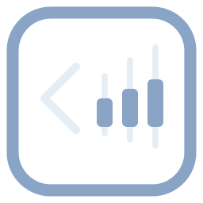

# BackTrade

<div align="center">



**Professional Trading Backtesting Platform**

[](LICENSE)
[](https://www.typescriptlang.org/)
[](https://reactjs.org/)
[](https://nodejs.org/)
[](https://www.docker.com/)

_A deterministic multi-session historical trading simulator for professional traders and quantitative analysts_

</div>

---

## Overview

BackTrade is a sophisticated trading backtesting platform that enables professional traders and quantitative analysts to conduct comprehensive historical trading simulations. The platform provides a deterministic environment where users can launch trading sessions at any historical timestamp, execute trades as if operating in real-time during past market conditions, and access detailed performance analytics.

### Key Features

- **Multi-Session Management**: Run multiple concurrent trading sessions with different instruments and parameters
- **Real-Time Simulation**: Interactive time controls with play/pause functionality and variable speed settings (0.5x to 10x)
- **Advanced Analytics**: Comprehensive trading performance metrics and detailed session analytics
- **Professional Tools**: Position management, risk controls, and sophisticated order execution
- **Role-Based Access**: Tiered subscription system with different session limits and features
- **Multiple Instruments**: Support for various trading instruments (XAUUSD, EURUSD, etc.) and timeframes
- **Modern UI**: Intuitive React-based interface with interactive candlestick charts

## Architecture

BackTrade is built as a modern, scalable monorepo:

### Technology Stack

**Frontend:**

- **React** for interactivity
- **TypeScript** for type safety
- **Vite** for fast development and building
- **React Router** for client-side routing
- **TanStack Query** for server state management
- **Zustand** for client state management
- **Lightweight Charts** for candlestick visualization
- **Zod** for schema validation
- **Jest** for testing

**Backend:**

- **Node.js 18+** with Express 5.1
- **TypeScript** for type safety
- **Prisma** for database ORM
- **PostgreSQL** database
- **Redis (ioredis)** for caching
- **Zod** for schema validation
- **Pino** for structured logging
- **Argon2** for password hashing
- **Helmet** for security headers
- **CORS** for cross-origin requests
- **Rate limiting** for API protection

**Infrastructure:**

- **Docker** containerization
- **PostgreSQL** database
- **Redis** for caching
- **Nginx** proxy
- **Cloudflare Tunnel** for secure access
- **pnpm** workspace management
- **Turbo** for monorepo orchestration

### Project Structure

```text
BackTrade/
├── apps/
│   ├── api/                 # Express.js backend API
│   └── web/                 # React frontend application
├── packages/
│   ├── types/               # Shared TypeScript types and Zod schemas
│   ├── utils/               # Shared utilities
│   ├── eslint-config/       # Shared ESLint configuration
│   └── tsconfig/            # Shared TypeScript configuration
├── docker/                  # Docker configuration and images
├── documentation/           # Project documentation and mockups
└── assets/                  # Brand assets and logos
```

## Getting Started

### Prerequisites

- **Node.js** 18 or higher
- **pnpm** 10.18.1 or higher
- **Docker** and **Docker Compose**
- **Git**

### Installation

1. **Clone the repository**

   ```bash
   git clone https://github.com/DamienReichhart/BackTrade.git
   cd BackTrade
   ```

2. **Install dependencies**

   ```bash
   pnpm install
   ```

3. **Configure environment variables**

   Before starting the development environment, you must create two `.env` files:

   - **API environment file**: Create `apps/api/.env` based on `apps/api/.env.example`
   - **Root environment file**:
     - For Docker development: Create `.env` in the root directory based on `.env.development.example`
     - For Docker production: Create `.env` in the root directory based on `.env.production.example`

   ```bash
   # Copy API environment file
   cp apps/api/.env.example apps/api/.env

   # Copy root environment file (for development)
   cp .env.development.example .env
   ```

   **Important**: Edit both `.env` files and fill in the required values before proceeding.

4.a Docker Development (recommanded)

**Note**: Ensure you have created the `.env` files as described in step 3 of the Installation section before starting Docker services.

For a complete development environment with database:

```bash
docker-compose -f docker-dev.yaml up -d
```

Initialize the database (run Prisma migrations and seed data):

```bash
docker-compose -f docker-dev.yaml exec dev pnpm --filter @backtrade/api prisma:init
```

4.b **Start development environment (not recommanded)**

   ```bash
   # Using pnpm directly
   pnpm dev

   # If using json-server (not recommended)
   cd apps/web && pnpm fake-api
   ```

5. **Access the application**

   - **Frontend**: http://localhost:5173
   - **API**: http://localhost:3000
   - **API Health Check**: http://localhost:3000/api/v1/health

### Code Quality

The project enforces high code quality standards:

- **ESLint** for code linting
- **TypeScript** for type safety
- **Jest** for comprehensive testing
- **Pre-Commit** for git hooks

### Testing

```bash
# Run all tests
pnpm test

# Run tests in watch mode
pnpm test:watch

# Run tests with coverage
pnpm test:coverage
```

## Deployment

### Production Deployment

1. **Build the application**

   ```bash
   pnpm build
   ```

2. **Deploy with Docker**

   ```bash
   make docker-prod
   ```

3. **Environment Configuration**
   - Set up environment variables
   - Configure database connection
   - Set up Cloudflare Tunnel token

### Docker Services

The production setup includes:

- **Frontend**: React application served by Nginx
- **Backend**: Express.js API server
- **Database**: PostgreSQL with persistent storage
- **Proxy**: Nginx proxy
- **Tunnel**: Cloudflare Tunnel for secure access

## Core Features

### Trading Sessions

- Create sessions with custom instruments
- Configure initial balance, leverage, and risk parameters
- Set spread, slippage, and commission models

### Real-Time Simulation

- Interactive time controls (play/pause/speed: 0.5x to 15x)
- Live candlestick chart visualization
- Real-time position tracking and P&L updates
- Deterministic historical replay

### Position Management

- Market order execution (Buy/Sell)
- Take Profit and Stop Loss levels
- Dynamic TP/SL modification
- Bulk position management (Close All)
- Position sizing in standard lots

### Analytics

- Comprehensive performance metrics
- Detailed session analytics
- Historical trade analysis
- Risk assessment tools

## Configuration

### Environment Variables

The project requires **two** `.env` files to be configured:

1. **API Environment File** (`apps/api/.env`):
   - Copy from `apps/api/.env.example`
   - Contains API-specific configuration (database URL, Redis, logging, etc.)

2. **Root Environment File** (`.env` in the root directory):
   - For development: Copy from `.env.development.example`
   - For production: Copy from `.env.production.example`
   - Contains Docker service configuration (PostgreSQL, Redis, Cloudflare Tunnel, etc.)

**Important**: Both `.env` files must be created and configured before starting the development environment or running Docker services. Refer to the example files for the required variables and their descriptions.

## Contributing

This is a proprietary project. Please contact the author for contribution guidelines and access permissions.

## License

This project is licensed under a **Proprietary License**. See the [LICENSE](LICENSE) file for details.

**Important**: This is a read-only license. No execution, copying, or distribution rights are granted.

## 👨‍💻 Author

**REICHHART Damien**

- Email: contact@damien-reichhart.fr
- Project: BackTrade Trading Platform

<div align="center">

**Built with ❤️ for the trading community**

[Report Bug](mailto:contact@damien-reichhart.fr) • [Request Feature](mailto:contact@damien-reichhart.fr) • [Documentation](documentation/)

</div>
