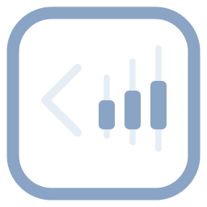

# BackTrade

<div align="center">



**Professional Trading Backtesting Platform**

[](https://www.typescriptlang.org/)
[](https://reactjs.org/)
[](https://nodejs.org/)
[](https://www.docker.com/)
[](https://pnpm.io/)

_A deterministic multi-session historical trading simulator for professional traders and quantitative analysts_

</div>

---

## Table of Contents

- [Overview](#overview)
- [Features](#features)
- [Architecture](#architecture)
- [Technology Stack](#technology-stack)
- [Prerequisites](#prerequisites)
- [Quick Start](#quick-start)
- [Development](#development)
- [Production Deployment](#production-deployment)
- [Configuration](#configuration)
- [Project Structure](#project-structure)
- [Available Scripts](#available-scripts)
- [Testing](#testing)
- [License](#license)
- [Contact](#contact)

---

## Overview

BackTrade is a sophisticated trading backtesting platform designed for professional traders and quantitative analysts. The platform provides a deterministic environment where users can launch trading sessions at any historical timestamp, execute trades as if operating in real-time during past market conditions, and access detailed performance analytics.

### Core Capabilities

- **Historical Trading Simulation**: Launch trading sessions at any historical timestamp with full market data replay
- **Multi-Session Management**: Run multiple concurrent trading sessions with different instruments and parameters
- **Real-Time Controls**: Interactive time controls with play/pause functionality and variable speed settings (0.5x, 1x, 2x, 5x, 10x)
- **Advanced Analytics**: Comprehensive trading performance metrics and detailed session analytics
- **Professional Tools**: Position management, risk controls, and sophisticated order execution
- **Subscription Tiers**: Role-based access control with tiered subscription system

---

## Features

### Trading Features

- **Multi-Session Management**: Run multiple concurrent trading sessions with different instruments
- **Real-Time Simulation**: Interactive time controls with play/pause and variable speed settings -**Position Management**: Open, modify, and close positions with real-time P&L tracking
- **Advanced Analytics**: Comprehensive trading performance metrics and session analytics
- **Multiple Instruments**: Support for various trading instruments (XAUUSD, EURUSD, etc.) and timeframes
- **Historical Data**: Full historical candlestick data stored in ClickHouse for fast retrieval

### Platform Features

- **User Authentication**: Secure JWT-based authentication with refresh tokens
- **Role-Based Access Control**: Tiered subscription system (User, Trader, Expert, Admin)
- **Subscription Management**: Stripe integration for payment processing and subscription management
- **Dataset Management**: Upload, process, and manage trading datasets
- **Email Notifications**: Automated email notifications for account events
- **Modern UI**: Intuitive React-based interface with interactive candlestick charts
- **Background Processing**: Asynchronous job processing with RabbitMQ
- **Object Storage**: MinIO integration for dataset file storage
- **Caching Layer**: Redis-based caching for improved performance

### Infrastructure Features

- **Microservices Architecture**: Separate services for API, Worker, and Scheduler
- **Database Migrations**: Automated Prisma migrations with health checks
- **Queue Retry System**: Automatic retry mechanism for failed jobs
- **Health Monitoring**: Comprehensive health checks for all services
- **Security Hardening**: Non-root containers, capability dropping, and security best practices
- **Cloudflare Tunnel**: Secure remote access without exposing ports

---

## Architecture

BackTrade is built as a modern, scalable monorepo using **pnpm workspaces** and **Turbo** for efficient build orchestration.

### Services

The platform consists of the following services:

| Service               | Description                              | Port (Dev)  |
| --------------------- | ---------------------------------------- | ----------- |
| **Frontend**          | React web application served by Nginx    | 5173        |
| **Backend API**       | Express.js REST API server               | 21799       |
| **Worker**            | Background job processor for async tasks | -           |
| **Scheduler**         | Scheduled tasks and queue retry handler  | -           |
| **PostgreSQL**        | Primary relational database              | 5432        |
| **Redis**             | Caching and session storage              | 6379        |
| **ClickHouse**        | Analytics database for time-series data  | 8123, 9002  |
| **MinIO**             | Object storage for datasets              | 9000, 9001  |
| **RabbitMQ**          | Message queue for job processing         | 5672, 15672 |
| **Nginx**             | Reverse proxy (production only)          | 80          |
| **Cloudflare Tunnel** | Secure remote access (production only)   | -           |

### Network Architecture

The production environment uses three isolated Docker networks:

- **Backend Network** (`192.168.250.0/24`): Database, cache, storage, and message queue services
- **Frontend Network** (`192.168.251.0/24`): Frontend and backend API communication
- **Public Network** (`192.168.252.0/24`): Proxy and tunnel services

---

## Technology Stack

### Frontend

- **React** - Modern UI framework
- **TypeScript** - Type-safe development
- **Vite** - Fast development and optimized production builds
- **React Router** - Client-side routing
- **React Query** - Server state management and data fetching
- **Zustand** - Lightweight client state management
- **Lightweight Charts** - High-performance candlestick visualization
- **Zod** - Schema validation and type inference
- **Jest** - Testing framework

### Backend

- **Node.js** with **Express** - High-performance API server
- **TypeScript** - Type-safe backend development
- **Prisma** - Modern database ORM with type safety
- **PostgreSQL** - Robust relational database
- **ClickHouse** - Analytics database for time-series data
- **Redis** (ioredis) - High-performance caching layer
- **RabbitMQ** - Message queue for asynchronous processing
- **MinIO** - S3-compatible object storage
- **Zod** - Request/response validation
- **Pino** - Structured logging
- **Argon2** - Secure password hashing
- **Helmet** - Security headers
- **CORS** - Cross-origin resource sharing
- **Stripe** - Payment processing

## Prerequisites

Before you begin, ensure you have the following installed:

- **Node.js** (LTS version recommended)
- **pnpm** (version 10.20.0 or later)
- **Docker** (version 20.10 or later)
- **Docker Compose** (version 2.0 or later)
- **Git**

### Verify Installation

```bash
node --version    # Should be LTS version
pnpm --version    # Should be 10.20.0 or later
docker --version  # Should be 20.10+
docker compose version  # Should be 2.0+
```

---

## Quick Start

### 1. Clone the Repository

```bash
git clone https://github.com/DamienReichhart/BackTrade.git
cd BackTrade
```

### 2. Install Dependencies

```bash
pnpm install
```

### 3. Configure Environment Variables

The project requires environment configuration files:

#### Root Environment File

Create `.env` in the root directory (for Docker services):

```bash
# Copy from example (if available) or create manually
cp .env.example .env
cp .env.example apps/api/.env
cp .env.example apps/worker/.env
cp .env.example apps/scheduler/.env
```

### 4. Start Development Environment

#### Option A: Using Docker Compose (Recommended)

Start all services:

```bash
docker compose -f docker-dev.yaml up -d
```

Initialize the database (run migrations and seed data):

```bash
docker compose -f docker-dev.yaml exec tools pnpm --filter @backtrade/data prisma:init
```

Or use the Makefile:

```bash
make setup  # Installs dependencies, builds, starts dev, and initializes database
```

### 5. Access the Application

Once all services are running:

- **Frontend**: [http://localhost:5173](http://localhost:5173)
- **API**: [http://localhost:21799](http://localhost:21799)
- **API Health Check**: [http://localhost:21799/api/v1/health](http://localhost:21799/api/v1/health)
- **RabbitMQ Management**: [http://localhost:15672](http://localhost:15672)
- **MinIO Console**: [http://localhost:9001](http://localhost:9001)

---

## Development

### Development Workflow

1. **Start Development Environment**

    ```bash
    make dev
    ```

2. **Access Development Container**

    ```bash
    make dev-shell
    ```

3. **Run Database Migrations**

    ```bash
    make db-migrate
    ```

4. **View Logs**

    ```bash
    make dev-logs
    ```

### Code Quality

The project enforces high code quality standards:

- **ESLint** - Code linting and style enforcement
- **TypeScript** - Static type checking
- **Prettier** - Code formatting
- **Jest** - Comprehensive test coverage
- **Pre-Commit Hooks** - Automated quality checks

### Git Commit Standards

All commits must follow the [Conventional Commits](https://www.conventionalcommits.org/) specification with required type and scope. See `documentation/git-commit-standards.md` for details.

### Makefile Commands

The project includes a comprehensive Makefile for common operations:

#### Development

```bash
make dev              # Start development environment
make dev-build        # Build and start development environment
make dev-stop         # Stop development environment
make dev-down         # Stop and remove development containers
make dev-logs         # View development environment logs
make dev-shell        # Open shell in development container
make dev-restart      # Restart development environment
```

#### Database Management

```bash
make db-init          # Initialize database (generate, deploy migrations, and seed)
make db-generate      # Generate Prisma client
make db-migrate       # Run Prisma migrations
make db-deploy        # Deploy Prisma migrations (production mode)
make db-seed          # Seed database with initial data
make db-studio        # Open Prisma Studio (database GUI)
```

#### Code Quality

```bash
make lint             # Run ESLint on all packages
make typecheck        # Run TypeScript type checking
make format           # Format code with Prettier
make format-check     # Check code formatting
make test             # Run all tests
make test-coverage    # Run tests with coverage report
make quality          # Run all code quality checks (lint + typecheck + format-check)
```

#### Build & Start

```bash
make build            # Build all packages and applications
make start            # Start all build services (non-docker)
```

#### Cleanup

```bash
make clean            # Clean build artifacts and node_modules
make clean-all        # Clean everything including Docker volumes
make prune            # Remove unused Docker resources
```

---

## Production Deployment

### Prerequisites

- All environment variables configured (see [Configuration](#configuration))
- Docker and Docker Compose installed
- Sufficient system resources (see resource limits in `docker-prod.yaml`)

### Deployment Steps

1. **Configure Environment Variables**

    Ensure all required environment variables are set in the root `.env` file.

2. **Build and Start Services**

    ```bash
    docker compose -f docker-prod.yaml up -d --build
    ```

    Or using Makefile:

    ```bash
    make prod-build
    ```

3. **Verify Services**

    Check service health:

    ```bash
    docker compose -f docker-prod.yaml ps
    docker compose -f docker-prod.yaml logs -f
    ```

4. **Access the Application**
    - If using Cloudflare Tunnel: Access via your configured tunnel URL
    - If testing locally: [http://localhost](http://localhost) (port 80)

### Production Services

The production stack includes:

- **Frontend**: React application served by Nginx (distroless image)
- **Backend**: Express.js API server with health checks
- **Worker**: Background job processor for async tasks
- **Scheduler**: Scheduled tasks and queue retry handler
- **Migrate**: Database migration service (runs once on startup)
- **PostgreSQL**: Primary database with persistent storage
- **Redis**: Caching layer with persistent storage
- **ClickHouse**: Analytics database with persistent storage
- **MinIO**: Object storage with persistent storage
- **RabbitMQ**: Message queue with persistent storage
- **Proxy**: Nginx reverse proxy
- **Cloudflare Tunnel**: Secure remote access

### Production Makefile Commands

```bash
make prod             # Start production environment
make prod-build       # Build and start production environment
make prod-stop        # Stop production environment
make prod-down        # Stop and remove production containers
make prod-logs        # View production environment logs
make prod-restart     # Restart production environment
```

## Project Structure

```
BackTrade/
├── apps/
│   ├── api/                    # Express.js backend API
│   ├── web/                    # React frontend application
│   ├── worker/                 # Background job processor
│   └── scheduler/              # Scheduled tasks service
├── packages/
│   ├── datas/                  # Data access layer (Prisma, ClickHouse, repositories)
│   ├── types/                  # Shared TypeScript types and Zod schemas
│   ├── utils/                  # Shared utility functions
│   ├── cache/                  # Redis caching layer
│   ├── queue/                  # RabbitMQ integration
│   ├── storage/                # MinIO object storage integration
│   ├── mailer/                 # Email service
│   ├── logger/                 # Structured logging
│   ├── eslint-config/          # Shared ESLint configuration
│   └── tsconfig/               # Shared TypeScript configuration
├── docker/
│   ├── images/                 # Dockerfile definitions
│   └── config/                 # Service configuration files
├── k8s/                        # Kubernetes deployment manifests
├── documentation/              # Project documentation
└── assets/                     # Brand assets and logos
```

## Available Scripts

### Root Scripts

```bash
pnpm dev              # Start all services in development mode
pnpm build            # Build all packages and applications
pnpm start            # Start all build services
pnpm typecheck        # Type check all packages
pnpm lint             # Lint all packages
pnpm test             # Run all tests
pnpm test:coverage    # Run tests with coverage report
pnpm format           # Format code with Prettier
pnpm format:check     # Check code formatting
```

### Package-Specific Scripts

Each package and app has its own scripts defined in its `package.json`. Use Turbo filters to run scripts in specific packages:

```bash
pnpm --filter @backtrade/api <script>
pnpm --filter @backtrade/web <script>
pnpm --filter @backtrade/data <script>
```

---

## Testing

### Run Tests

```bash
# Run all tests
pnpm test

# Run tests in watch mode
pnpm test:watch

# Run tests with coverage report
pnpm test:coverage
```

---

## License

This project is licensed under a **Proprietary License**. See the [LICENSE](LICENSE) file for details.

**Important**: This is a read-only license. No execution, copying, or distribution rights are granted.

---

## Contact

**REICHHART Damien**

- Email: <contact@damien-reichhart.fr>
- Project: BackTrade Trading Platform

---

<div align="center">

**Built with ❤️ for the trading community**

[Report Bug](mailto:contact@damien-reichhart.fr) •
[Request Feature](mailto:contact@damien-reichhart.fr) •
[Documentation](documentation/)

</div>
