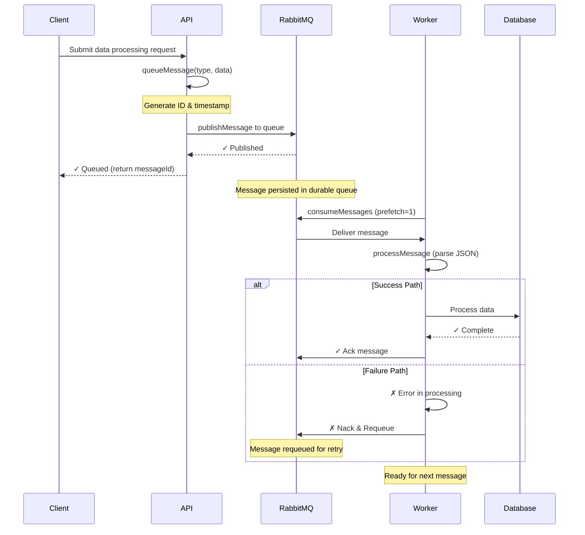

```mermaid
sequenceDiagram
    participant Client
    participant API
    participant RabbitMQ
    participant Worker
    participant Database

    Client->>API: Submit data processing request
    API->>API: queueMessage(type, data)
    Note over API: Generate ID & timestamp
    API->>RabbitMQ: publishMessage to queue
    RabbitMQ-->>API: ✓ Published
    API-->>Client: ✓ Queued (return messageId)

    Note over RabbitMQ: Message persisted in durable queue

    Worker->>RabbitMQ: consumeMessages (prefetch=1)
    RabbitMQ->>Worker: Deliver message
    Worker->>Worker: processMessage (parse JSON)

    alt Success Path
        Worker->>Database: Process data
        Database-->>Worker: ✓ Complete
        Worker->>RabbitMQ: ✓ Ack message
    else Failure Path
        Worker->>Worker: ✗ Error in processing
        Worker->>RabbitMQ: ✗ Nack & Requeue
        Note over RabbitMQ: Message requeued for retry
    end

    Note over Worker: Ready for next message
```
