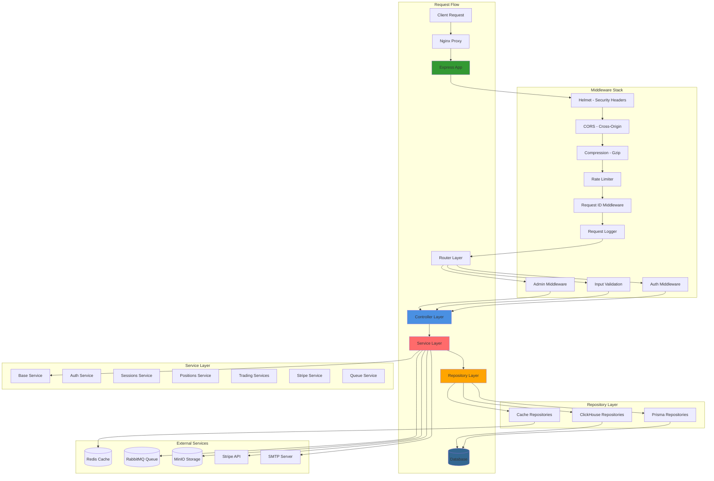

```mermaid
graph TB
    subgraph "Request Flow"
        Client[Client Request]
        Proxy[Nginx Proxy]
        Express[Express App]
        Router[Router Layer]
        Controller[Controller Layer]
        Service[Service Layer]
        Repository[Repository Layer]
        Database[(Database)]
    end

    subgraph "Middleware Stack"
        Helmet[Helmet - Security Headers]
        CORS[CORS - Cross-Origin]
        Compression[Compression - Gzip]
        RateLimit[Rate Limiter]
        RequestID[Request ID Middleware]
        RequestLogger[Request Logger]
        Auth[Auth Middleware]
        Validation[Input Validation]
        Admin[Admin Middleware]
    end

    subgraph "Service Layer"
        BaseService[Base Service]
        AuthService[Auth Service]
        SessionsService[Sessions Service]
        PositionsService[Positions Service]
        TradingServices[Trading Services]
        StripeService[Stripe Service]
        QueueService[Queue Service]
    end

    subgraph "Repository Layer"
        PrismaRepo[Prisma Repositories]
        ClickHouseRepo[ClickHouse Repositories]
        CacheRepo[Cache Repositories]
    end

    subgraph "External Services"
        Redis[(Redis Cache)]
        RabbitMQ[(RabbitMQ Queue)]
        MinIO[(MinIO Storage)]
        Stripe[Stripe API]
        SMTP[SMTP Server]
    end

    Client --> Proxy
    Proxy --> Express
    Express --> Helmet
    Helmet --> CORS
    CORS --> Compression
    Compression --> RateLimit
    RateLimit --> RequestID
    RequestID --> RequestLogger
    RequestLogger --> Router

    Router --> Auth
    Router --> Validation
    Router --> Admin

    Auth --> Controller
    Validation --> Controller
    Admin --> Controller

    Controller --> Service
    Service --> BaseService
    Service --> Repository

    Repository --> PrismaRepo
    Repository --> ClickHouseRepo
    Repository --> CacheRepo

    PrismaRepo --> Database
    ClickHouseRepo --> Database
    CacheRepo --> Redis

    Service --> RabbitMQ
    Service --> MinIO
    Service --> Stripe
    Service --> SMTP

    style Express fill:#339933
    style Controller fill:#4a90e2
    style Service fill:#ff6b6b
    style Repository fill:#ffa500
    style Database fill:#336791
```
