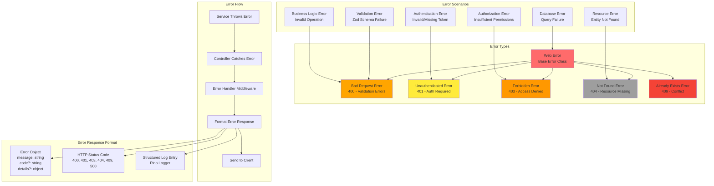

```mermaid
graph TB
    subgraph "Error Types"
        direction TB

        WebError[Web Error<br/>Base Error Class]
        BadRequestError[Bad Request Error<br/>400 - Validation Errors]
        UnauthenticatedError[Unauthenticated Error<br/>401 - Auth Required]
        ForbiddenError[Forbidden Error<br/>403 - Access Denied]
        NotFoundError[Not Found Error<br/>404 - Resource Missing]
        AlreadyExistsError[Already Exists Error<br/>409 - Conflict]
    end

    subgraph "Error Flow"
        direction TB

        ServiceError[Service Throws Error]
        ControllerCatch[Controller Catches Error]
        ErrorHandler[Error Handler Middleware]
        FormatError[Format Error Response]
        ClientResponse[Send to Client]
    end

    subgraph "Error Response Format"
        direction LR
        ErrorObject[Error Object<br/>message: string<br/>code?: string<br/>details?: object]
        StatusCode[HTTP Status Code<br/>400, 401, 403, 404, 409, 500]
        LogEntry[Structured Log Entry<br/>Pino Logger]
    end

    WebError --> BadRequestError
    WebError --> UnauthenticatedError
    WebError --> ForbiddenError
    WebError --> NotFoundError
    WebError --> AlreadyExistsError

    ServiceError --> ControllerCatch
    ControllerCatch --> ErrorHandler
    ErrorHandler --> FormatError
    FormatError --> ErrorObject
    FormatError --> StatusCode
    FormatError --> LogEntry
    FormatError --> ClientResponse

    subgraph "Error Scenarios"
        direction TB
        S1[Validation Error<br/>Zod Schema Failure]
        S2[Authentication Error<br/>Invalid/Missing Token]
        S3[Authorization Error<br/>Insufficient Permissions]
        S4[Resource Error<br/>Entity Not Found]
        S5[Business Logic Error<br/>Invalid Operation]
        S6[Database Error<br/>Query Failure]
    end

    S1 --> BadRequestError
    S2 --> UnauthenticatedError
    S3 --> ForbiddenError
    S4 --> NotFoundError
    S5 --> BadRequestError
    S6 --> WebError

    style WebError fill:#ff6b6b
    style BadRequestError fill:#ffa500
    style UnauthenticatedError fill:#ffeb3b
    style ForbiddenError fill:#ff9800
    style NotFoundError fill:#9e9e9e
    style AlreadyExistsError fill:#f44336
```
