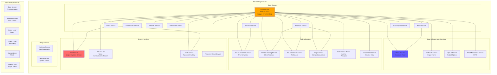

```mermaid
graph TB
    subgraph "Service Organization"
        direction TB

        subgraph "Base Services"
            BaseService[Base Service<br/>Abstract Class<br/>Logger, Error Handling]
            UsersService[Users Service]
            SessionsService[Sessions Service]
            PositionsService[Positions Service]
            TransactionsService[Transactions Service]
            DatasetsService[Datasets Service]
            InstrumentsService[Instruments Service]
            PlansService[Plans Service]
            SubscriptionsService[Subscriptions Service]
        end

        subgraph "Security Services"
            AuthService[Auth Service<br/>Login, Register, Refresh]
            JwtService[JWT Service<br/>Token Generation/Verification]
            HashService[Hash Service<br/>Password Hashing]
            PasswordResetService[Password Reset Service]
        end

        subgraph "Trading Services"
            BarAdvancementService[Bar Advancement Service<br/>Time Simulation]
            PositionClosingService[Position Closing Service<br/>Close Positions]
            PnLCalculationService[P&L Calculation Service<br/>Profit/Loss]
            MarginService[Margin Service<br/>Margin Calculations]
            PerformanceMetricsService[Performance Metrics Service<br/>Analytics]
            SessionInfoService[Session Info Service<br/>Session Data]
        end

        subgraph "External Integration Services"
            StripeService[Stripe Service<br/>Checkout, Portal]
            WebhookService[Webhook Service<br/>Stripe Events]
            QueueService[Queue Service<br/>RabbitMQ Jobs]
            EmailNotificationService[Email Notification Service<br/>SMTP]
        end

        subgraph "Utility Services"
            AnalyticsService[Analytics Service<br/>Data Aggregation]
            HealthService[Health Service<br/>System Health]
        end
    end

    subgraph "Service Dependencies"
        direction LR
        Dep1[Base Service<br/>Provides Logger]
        Dep2[Repository Layer<br/>Data Access]
        Dep3[Cache Layer<br/>Redis]
        Dep4[Queue Layer<br/>RabbitMQ]
        Dep5[Storage Layer<br/>MinIO]
        Dep6[External APIs<br/>Stripe, SMTP]
    end

    BaseService --> UsersService
    BaseService --> SessionsService
    BaseService --> PositionsService
    BaseService --> TransactionsService
    BaseService --> DatasetsService
    BaseService --> InstrumentsService
    BaseService --> PlansService
    BaseService --> SubscriptionsService

    BaseService --> AuthService
    BaseService --> JwtService
    BaseService --> HashService
    BaseService --> PasswordResetService

    BaseService --> BarAdvancementService
    BaseService --> PositionClosingService
    BaseService --> PnLCalculationService
    BaseService --> MarginService
    BaseService --> PerformanceMetricsService
    BaseService --> SessionInfoService

    BaseService --> StripeService
    BaseService --> WebhookService
    BaseService --> QueueService
    BaseService --> EmailNotificationService

    SessionsService --> BarAdvancementService
    PositionsService --> PositionClosingService
    PositionsService --> PnLCalculationService
    PositionsService --> MarginService

    UsersService --> AuthService
    UsersService --> HashService

    SubscriptionsService --> StripeService
    PlansService --> StripeService

    style BaseService fill:#ffa500
    style AuthService fill:#ff6b6b
    style StripeService fill:#635bff
```
