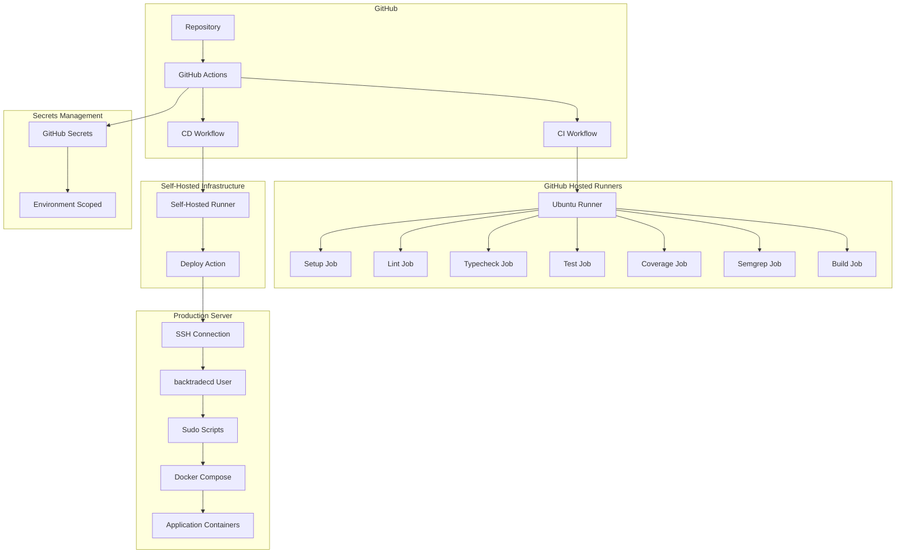

# CI/CD Architecture

## System Architecture

The BackTrade CI/CD system consists of multiple components working together to ensure reliable, secure, and automated deployments.

## High-Level Architecture

