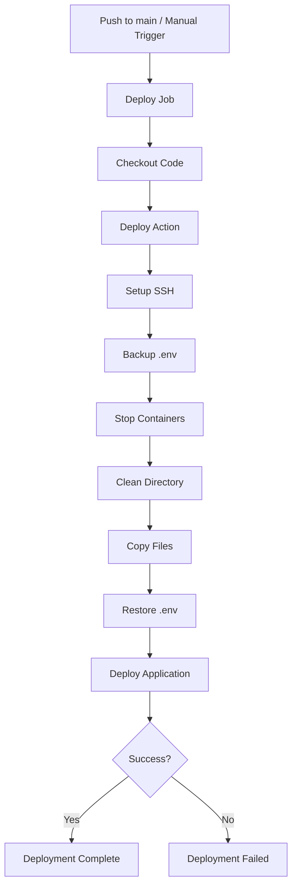
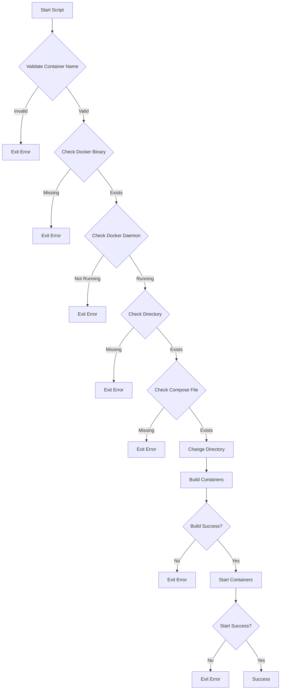
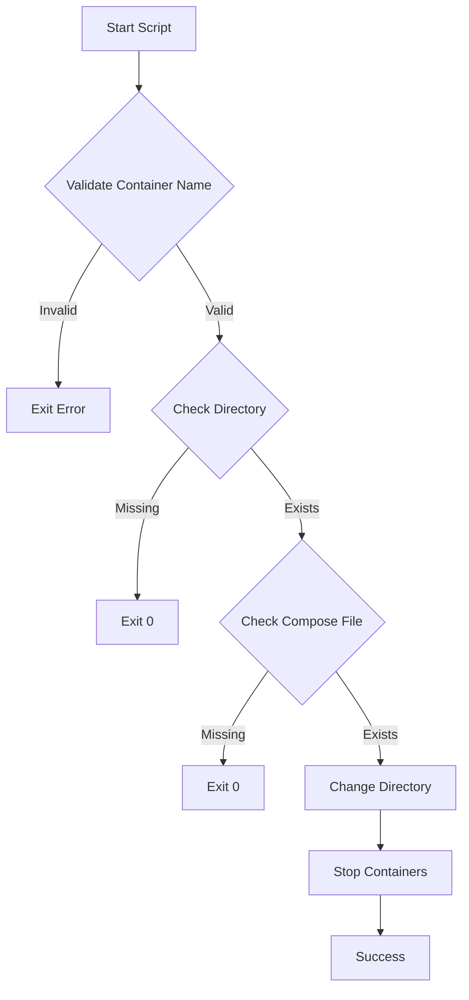
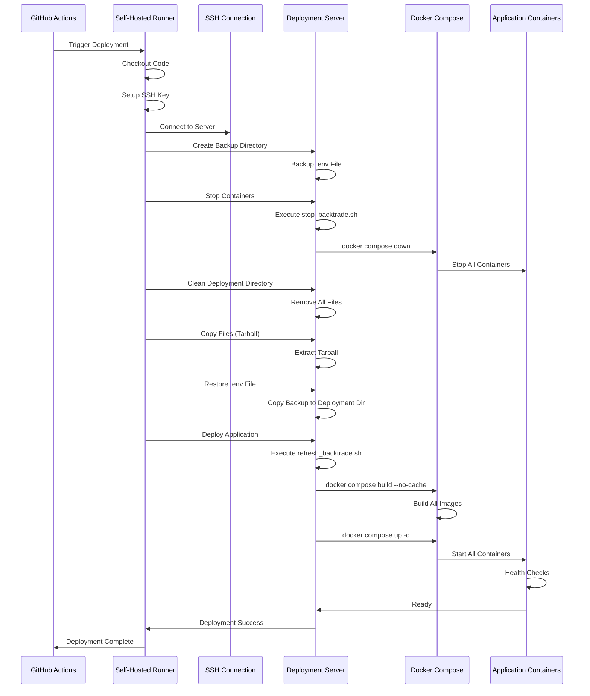

# Continuous Deployment (CD) Process

## Overview

The CD workflow automates the deployment of BackTrade to production infrastructure. It runs automatically when code is merged to the `main` branch, or can be triggered manually via workflow dispatch.

## Workflow Configuration

**File**: `.github/workflows/cd.yml`

**Triggers**:
- **Automatic**: Push to `main` branch
- **Manual**: Workflow dispatch with optional environment selection

**Runner**: `self-hosted` (infrastructure-based GitHub Actions runner)

**Environment**: `PROD` environment via workflow dispatch input

## Workflow Structure



## Deployment Job

### Job Configuration

**Name**: `Deploy`

**Runner**: `self-hosted`

**Environment**: Dynamic based on workflow input (default: `PROD`)

**Steps**:
1. Checkout repository code
2. Execute deployment via reusable action

### Deployment Action

**File**: `.github/actions/deploy/action.yml`

**Type**: Composite action (bash-based)

**Inputs**:
- `ssh_host`: SSH hostname or IP address
- `ssh_port`: SSH port (default: 22)
- `ssh_user`: SSH username
- `ssh_key`: Private SSH key for authentication
- `remote_dir`: Remote directory for deployment

## Deployment Process

### Step 1: Setup SSH Key

**Purpose**: Configure SSH authentication for remote server access

**Actions**:
1. Create `~/.ssh` directory
2. Write SSH private key to `~/.ssh/id_deploy`
3. Set permissions to `600` (owner read/write only)
4. Configure SSH config with:
   - Host alias: `remote`
   - HostName: From `ssh_host` input
   - User: From `ssh_user` input
   - Port: From `ssh_port` input
   - IdentityFile: `~/.ssh/id_deploy`
   - StrictHostKeyChecking: `no` (for automation)

**Security**: SSH key is stored temporarily and removed after workflow completion

### Step 2: Backup Environment File

**Purpose**: Preserve production environment configuration

**Actions**:
1. Create deployment directory if it doesn't exist
2. Create backup directory: `/tmp/backtrade_deploy_backup`
3. If `.env` exists in deployment directory:
   - Copy to backup location
   - Log backup confirmation
4. If `.env` doesn't exist:
   - Log that no backup was needed

### Step 3: Stop Running Containers

**Purpose**: Gracefully stop existing containers before deployment

**Actions**:
1. Execute `stop_backtrade.sh` script via sudo
2. Script validates container name 
3. Script stops containers using Docker Compose

**Script**: `/usr/local/bin/stop_backtrade.sh`

**Execution**: `sudo /usr/local/bin/stop_backtrade.sh

### Step 4: Complete Directory Cleanup

**Purpose**: Remove all files from deployment directory for clean deployment

**Actions**:
1. Change to deployment directory
2. Remove all files and directories:
   - `./*`: All visible files
   - `./.[!.]*`: Hidden files (excluding `.` and `..`)
   - `./.??*`: Additional hidden files
3. Suppress errors for non-existent files (`2>/dev/null || true`)

### Step 5: Copy Files to Remote

**Purpose**: Transfer repository code to deployment server

**Method**: Tarball via SSH pipe

**Process**:
1. Create compressed tarball excluding:
   - `.git`: Version control files
   - `.github`: CI/CD configuration
   - `node_modules`: Dependencies (rebuilt on server)
   - `**/node_modules`: Nested dependencies
   - `dist`: Build artifacts (rebuilt on server)
   - `**/dist`: Nested build artifacts
   - `coverage`: Test coverage reports
   - `**/coverage`: Nested coverage reports
   - `.env`: Environment files (preserved separately)
   - `*.log`: Log files
   - `.vscode`, `.idea`: IDE configuration
   - `*.swp`, `*.swo`: Editor swap files
   - `.DS_Store`, `Thumbs.db`: OS-specific files
2. Pipe tarball through SSH to remote server
3. Extract tarball in deployment directory

**Command**:
```bash
tar --exclude='...' -czf - . | ssh remote "cd '$remote_dir' && tar -xzf -"
```

### Step 6: Restore Environment File

**Purpose**: Restore production environment configuration

**Actions**:
1. Check if backup exists: `/tmp/backtrade_deploy_backup/.env`
2. If backup exists:
   - Copy to deployment directory
   - Log restoration confirmation
3. If backup doesn't exist:
   - Log that no backup was found
4. Remove backup directory

### Step 7: Deploy Application

**Purpose**: Build and start application containers

**Actions**:
1. Execute `refresh_backtrade.sh` script via sudo
3. Script performs:
   - Docker Compose build with `--no-cache`
   - Docker Compose up in detached mode

**Script**: `/usr/local/bin/refresh_backtrade.sh`

**Execution**: `sudo /usr/local/bin/refresh_backtrade.sh`

### Deployment Scripts

#### `/usr/local/bin/refresh_backtrade.sh`

**Purpose**: Build and start containers

**Features**:

- Docker binary verification
- Docker daemon health check
- Directory and file existence checks
- Build with `--no-cache` flag
- Start containers in detached mode

#### Script content

```sh
#!/bin/bash

set -euo pipefail  # Exit on error, undefined vars, pipe failures

CONTAINER_NAME="$1"
BACKTRADE_DIR="/srv/backtrade"
COMPOSE_FILE="docker-prod.yaml"
DOCKER_BIN="/usr/bin/docker"

# Check docker binary exists
if [[ ! -x "$DOCKER_BIN" ]]; then
  echo "Error: Docker binary not found or not executable at $DOCKER_BIN" >&2
  exit 1
fi

# Check docker daemon is running
if ! "$DOCKER_BIN" info >/dev/null 2>&1; then
  echo "Error: Docker daemon is not running" >&2
  exit 1
fi

# Check directory exists
if [[ ! -d "$BACKTRADE_DIR" ]]; then
  echo "Error: Directory $BACKTRADE_DIR does not exist" >&2
  exit 1
fi

# Check compose file exists
if [[ ! -f "$BACKTRADE_DIR/$COMPOSE_FILE" ]]; then
  echo "Error: Compose file $BACKTRADE_DIR/$COMPOSE_FILE does not exist" >&2
  exit 1
fi

# Change to backtrade directory
cd "$BACKTRADE_DIR" || {
  echo "Error: Failed to change directory to $BACKTRADE_DIR" >&2
  exit 1
}

# Build with no cache
echo "Building containers..."
"$DOCKER_BIN" compose -f "$COMPOSE_FILE" build --no-cache || {
  echo "Error: Docker build failed" >&2
  exit 1
}

# Start containers
echo "Starting containers..."
"$DOCKER_BIN" compose -f "$COMPOSE_FILE" up -d || {
  echo "Error: Failed to start containers" >&2
  exit 1
}

echo "Deployment successful"
```

#### Script flow 



#### `/usr/local/bin/stop_backtrade.sh`

**Purpose**: Stop running containers

**Features**:

- Directory and file existence checks
- Graceful container shutdown

**Security**:

- Currently commented out (containers stopped via other means)

#### Script content

```sh
#!/bin/bash

set -e  # Exit on any error

CONTAINER_NAME="$1"
BACKTRADE_DIR="/srv/backtrade"
COMPOSE_FILE="docker-prod.yaml"

# Check directory exists
if [[ ! -d "$BACKTRADE_DIR" ]]; then
  echo "Error: Directory $BACKTRADE_DIR does not exist" >&2
  exit 0
fi

# Check docker-compose file exists
if [[ ! -f "$BACKTRADE_DIR/$COMPOSE_FILE" ]]; then
  echo "Error: Docker compose file $COMPOSE_FILE not found in $BACKTRADE_DIR" >&2
  exit 0
fi

# Execute docker compose down
cd "$BACKTRADE_DIR"
#docker compose -f "$COMPOSE_FILE" down || {
#  echo "Error: Failed to stop containers" >&2
#  exit 0
#}

echo "Containers stopped successfully"

```

#### Script flow 



### User Permissions

**User**: `backtradecd`

**Capabilities**:
- No root access
- No Docker group membership
- Can execute specific scripts via sudo without password
- Has only execution right on `refresh_backtrade.sh` and `stop_backtrade.sh`

**Sudoers Configuration** (`/etc/sudoers`):
```
backtradecd ALL=(ALL:ALL) NOPASSWD: /usr/local/bin/refresh_backtrade.sh
backtradecd ALL=(ALL:ALL) NOPASSWD: /usr/local/bin/stop_backtrade.sh
```

**Security Model**: Principle of least privilege - user can only execute approved scripts

## Deployment Sequence



## Required Secrets

All secrets are stored in GitHub repository secrets and scoped to the deployment environment.

### DEPLOY_SSH_HOST

**Purpose**: SSH server hostname or IP address

**Type**: String

**Example**: `backtrade.example.com` or `192.168.1.100`

### DEPLOY_SSH_PORT

**Purpose**: SSH server port

**Type**: String (numeric)

**Default**: `22`

**Example**: `22` or `2222`

### DEPLOY_SSH_USER

**Purpose**: SSH username for deployment

**Type**: String

**Example**: `backtradecd`

### DEPLOY_SSH_KEY

**Purpose**: Private SSH key for authentication

**Type**: Multi-line string (private key content)

**Format**: OpenSSH private key (PEM format)

**Security**: Never logged or exposed in workflow outputs

### DEPLOY_REMOTE_DIR

**Purpose**: Remote directory path for deployment

**Type**: String

**Example**: `/srv/backtrade`

## Environment Configuration

### Environment Selection

**Automatic**: Uses `PROD` environment for `main` branch deployments

**Manual**: Workflow dispatch input allows environment selection except for PROD wich is main only :

```yaml
environment: ${{ github.event.inputs.environment || 'PROD' }}
```

### Deployment Verification

After deployment, verify services are running:

```bash
# Check container status
docker compose -f docker-prod.yaml ps

# Check service health
curl http://localhost:21799/api/v1/health

# View logs
docker compose -f docker-prod.yaml logs -f backend
```
