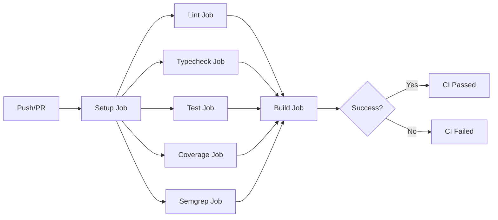
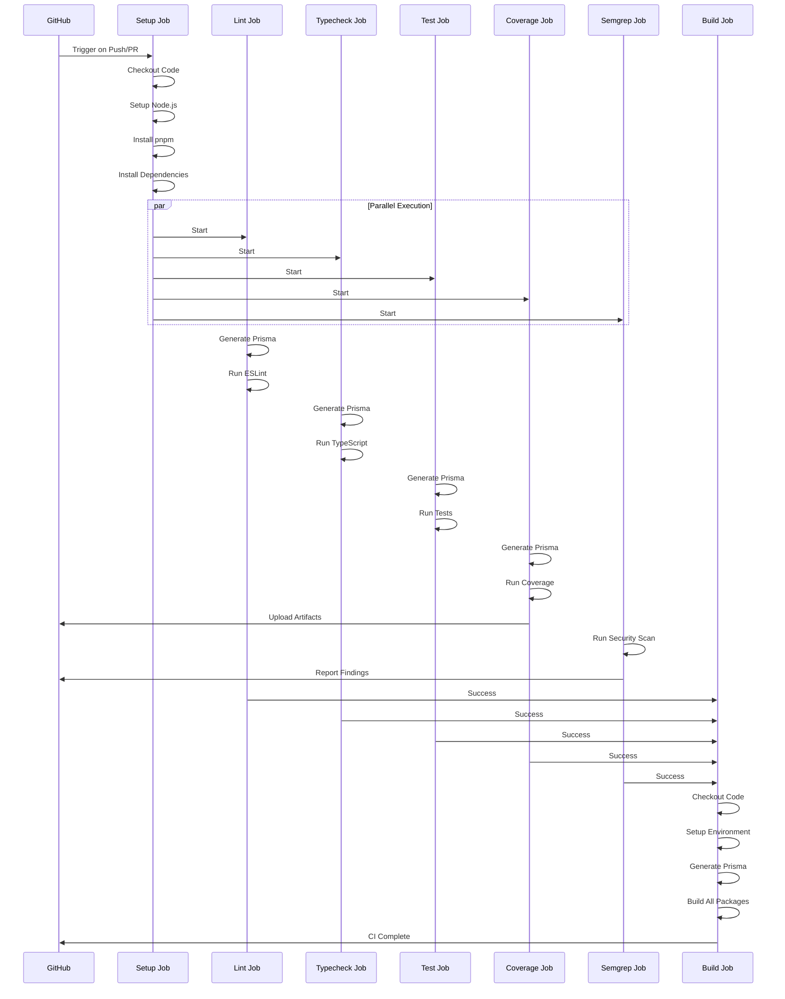

# Continuous Integration (CI) Process

## Overview

The CI workflow ensures code quality, type safety, test coverage, and security before code is merged or deployed. It runs automatically on every push and pull request to protected branches.

## Workflow Configuration

**File**: `.github/workflows/ci.yml`

**Triggers**:
- Push to branches: `main`, `dev`, `feature/*`
- Pull requests targeting: `main`, `dev`

**Runner**: GitHub-hosted `ubuntu-latest`

## Workflow Structure

## Job Details

### 1. Setup Job

**Purpose**: Prepare the CI environment and install dependencies

**Steps**:
1. Checkout repository code
2. Setup Node.js (via `setup-node@v4`)
3. Install pnpm globally
4. Install project dependencies with `--frozen-lockfile`

**Outputs**:
- `node`: Node.js version
- `pnpm`: pnpm version

**Reusable Action**: `.github/actions/setup`

### 2. Lint Job

**Purpose**: Enforce code quality standards via ESLint

**Dependencies**: `setup` job

**Steps**:
1. Checkout code
2. Setup environment (Node.js, pnpm, dependencies)
3. Generate Prisma Client (requires `DATABASE_URL` secret)
4. Run ESLint across the monorepo

**Reusable Actions**:
- `.github/actions/setup`
- `.github/actions/prisma-generate`
- `.github/actions/lint`

**Failure Impact**: Blocks merge and deployment

### 3. Typecheck Job

**Purpose**: Validate TypeScript type correctness

**Dependencies**: `setup` job

**Steps**:
1. Checkout code
2. Setup environment
3. Generate Prisma Client
4. Run TypeScript compiler in type-check mode

**Reusable Actions**:
- `.github/actions/setup`
- `.github/actions/prisma-generate`
- `.github/actions/typecheck`

**Failure Impact**: Blocks merge and deployment

### 4. Test Job

**Purpose**: Execute unit and integration tests

**Dependencies**: `setup` job

**Steps**:
1. Checkout code
2. Setup environment
3. Generate Prisma Client
4. Run test suite via pnpm

**Reusable Actions**:
- `.github/actions/setup`
- `.github/actions/prisma-generate`
- `.github/actions/test`

**Test Framework**: Vitest (configured per workspace)

**Failure Impact**: Blocks merge and deployment

### 5. Coverage Job

**Purpose**: Generate and report test coverage metrics

**Dependencies**: `setup` job

**Steps**:
1. Checkout code
2. Setup environment
3. Generate Prisma Client
4. Run tests with coverage collection
5. Upload coverage artifacts:
   - `api-coverage`: Coverage from `apps/api/coverage`
   - `web-coverage`: Coverage from `apps/web/coverage`

**Reusable Actions**:
- `.github/actions/setup`
- `.github/actions/prisma-generate`
- `.github/actions/test-coverage`

**Artifacts**: Coverage reports are preserved for 90 days

**Failure Impact**: Does not block merge (runs with `if: always()`)

### 6. Semgrep Job

**Purpose**: Security vulnerability scanning

**Dependencies**: `setup` job

**Permissions**:
- `security-events: write`: Report security findings
- `actions: read`: Access workflow context
- `contents: read`: Read repository code

**Steps**:
1. Checkout code
2. Run Semgrep security scan
3. Report findings to GitHub Security tab

**Reusable Actions**:
- `.github/actions/semgrep`

**Required Secret**: `SEMGREP_APP_TOKEN`

**Failure Impact**: Blocks merge and deployment

### 7. Build Job

**Purpose**: Verify production build succeeds

**Dependencies**: All previous jobs (`lint`, `typecheck`, `test`, `coverage`, `semgrep`)

**Steps**:
1. Checkout code
2. Setup environment
3. Generate Prisma Client
4. Build all packages and applications

**Reusable Actions**:
- `.github/actions/setup`
- `.github/actions/prisma-generate`
- `.github/actions/build`

**Build Command**: `pnpm build` (executes Turbo build pipeline)

**Failure Impact**: Blocks merge and deployment

## Job Execution Flow

