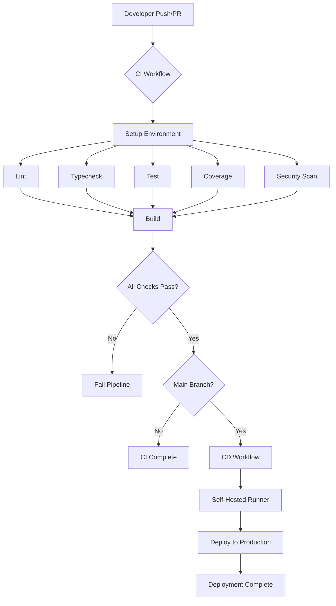

# CI/CD Overview

## Introduction

BackTrade employs a comprehensive Continuous Integration and Continuous Deployment (CI/CD) pipeline to ensure code quality, security, and reliable deployments. The pipeline is built on GitHub Actions and uses a self-hosted runner infrastructure for deployment operations.

## Architecture Overview

The CI/CD pipeline consists of two main workflows:

1. **CI (Continuous Integration)**: Automated testing, linting, type checking, security scanning, and building on every push and pull request
2. **CD (Continuous Deployment)**: Automated deployment to production infrastructure when code is merged to the `main` branch

## Pipeline Flow

## Key Components

### CI Workflow (`.github/workflows/ci.yml`)

- **Triggers**: Push to `main`, `dev`, `feature/*` branches and pull requests
- **Runs on**: GitHub-hosted Ubuntu runners
- **Jobs**:
  - Setup: Environment preparation and dependency installation
  - Lint: Code quality checks via ESLint
  - Typecheck: TypeScript type validation
  - Test: Unit and integration tests
  - Coverage: Test coverage analysis and artifact upload
  - Semgrep: Security vulnerability scanning
  - Build: Production build verification

### CD Workflow (`.github/workflows/cd.yml`)

- **Triggers**: 
  - Automatic: Push to `main` branch
  - Manual: Workflow dispatch with environment selection
- **Runs on**: Self-hosted runner (infrastructure-based)
- **Jobs**:
  - Deploy: Complete deployment process via SSH/SCP

### Secrets Management

- All sensitive data stored in GitHub Secrets
- Environment-scoped secrets for multi-environment support
- SSH keys never logged or exposed in workflow outputs

## Deployment Process

The deployment process follows these steps:

1. **Backup**: Environment file (`.env`) is backed up
2. **Stop**: Running containers are gracefully stopped
3. **Clean**: Deployment directory is completely cleaned
4. **Copy**: Repository files are transferred via SCP (excluding dev files)
5. **Restore**: Environment file is restored
6. **Deploy**: Containers are rebuilt and started
