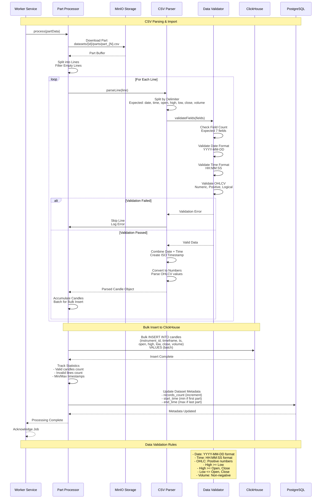

```mermaid
sequenceDiagram
    participant Worker as Worker Service
    participant PartProcessor as Part Processor
    participant MinIO as MinIO Storage
    participant Parser as CSV Parser
    participant Validator as Data Validator
    participant ClickHouse as ClickHouse
    participant DB as PostgreSQL

    Note over Worker,DB: CSV Parsing & Import

    Worker->>PartProcessor: process(partData)
    PartProcessor->>MinIO: Download Part<br/>datasets/{id}/parts/part_{N}.csv
    MinIO-->>PartProcessor: Part Buffer

    PartProcessor->>PartProcessor: Split into Lines<br/>Filter Empty Lines

    loop For Each Line
        PartProcessor->>Parser: parseLine(line)
        Parser->>Parser: Split by Delimiter<br/>Expected: date, time, open, high, low, close, volume

        Parser->>Validator: validateFields(fields)
        Validator->>Validator: Check Field Count<br/>Expected 7 fields
        Validator->>Validator: Validate Date Format<br/>YYYY-MM-DD
        Validator->>Validator: Validate Time Format<br/>HH:MM:SS
        Validator->>Validator: Validate OHLCV<br/>Numeric, Positive, Logical

        alt Validation Failed
            Validator-->>Parser: Validation Error
            Parser->>PartProcessor: Skip Line<br/>Log Error
        else Validation Passed
            Validator-->>Parser: Valid Data
            Parser->>Parser: Combine Date + Time<br/>Create ISO Timestamp
            Parser->>Parser: Convert to Numbers<br/>Parse OHLCV values
            Parser-->>PartProcessor: Parsed Candle Object
            PartProcessor->>PartProcessor: Accumulate Candles<br/>Batch for Bulk Insert
        end
    end

    Note over PartProcessor,ClickHouse: Bulk Insert to ClickHouse

    PartProcessor->>ClickHouse: Bulk INSERT INTO candles<br/>(instrument_id, timeframe, ts,<br/>open, high, low, close, volume)<br/>VALUES (batch)
    ClickHouse-->>PartProcessor: Insert Complete

    PartProcessor->>PartProcessor: Track Statistics<br/>- Valid candles count<br/>- Invalid lines count<br/>- Min/Max timestamps

    PartProcessor->>DB: Update Dataset Metadata<br/>- records_count (increment)<br/>- start_time (min if first part)<br/>- end_time (max if last part)
    DB-->>PartProcessor: Metadata Updated

    PartProcessor-->>Worker: Processing Complete
    Worker-->>Worker: Acknowledge Job

    Note over Worker,DB: Data Validation Rules

    Note over Validator: - Date: YYYY-MM-DD format<br/>- Time: HH:MM:SS format<br/>- OHLC: Positive numbers<br/>- High >= Low<br/>- High >= Open, Close<br/>- Low <= Open, Close<br/>- Volume: Non-negative
```
