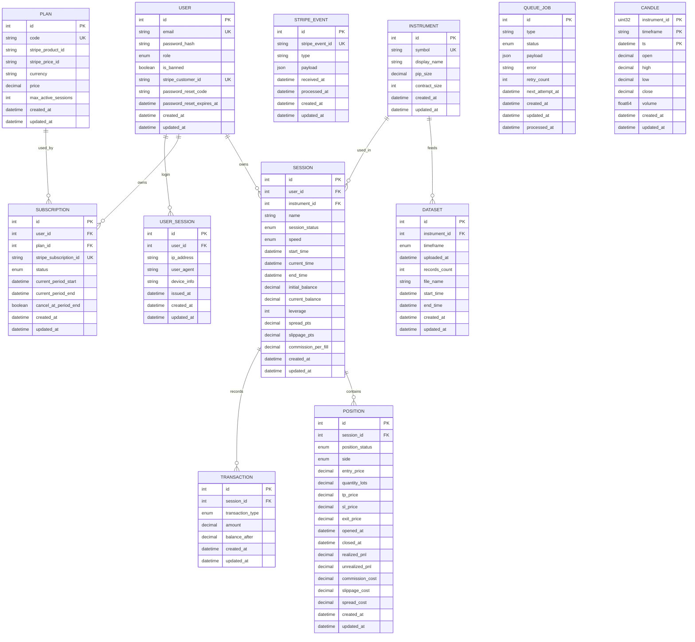

```mermaid
erDiagram
    %% =========================
    %% ENUMS (defined in code)
    %% =========================
    %% Role: ANONYMOUS | USER | ADMIN
    %% SessionStatus: RUNNING | PAUSED | ARCHIVED
    %% PositionStatus: OPEN | CLOSED | LIQUIDATED
    %% Timeframe: M1 | M5 | M10 | M15 | M30 | H1 | H2 | H4 | D1 | W1
    %% Side: BUY | SELL
    %% Speed: SPEED_0_5X (0.5x) | SPEED_1X (1x) | SPEED_2X (2x) | SPEED_3X (3x) | SPEED_5X (5x) | SPEED_10X (10x) | SPEED_15X (15x)
    %% TransactionType: DEPOSIT | WITHDRAWAL | COMMISSION | PNL | SLIPPAGE | SPREAD | ADJUSTMENT
    %% SubscriptionStatus: active | canceled
    %% JobStatus: PENDING | PROCESSING | COMPLETED | FAILED | RETRYING | QUEUE_FAILED | PERMANENTLY_FAILED

    USER {
        int id PK
        string email UK
        string password_hash
        enum role
        boolean is_banned
        string stripe_customer_id UK
        string password_reset_code
        datetime password_reset_expires_at
        datetime created_at
        datetime updated_at
    }

    USER_SESSION {
        int id PK
        int user_id FK
        string ip_address
        string user_agent
        string device_info
        datetime issued_at
        datetime created_at
        datetime updated_at
    }

    PLAN {
        int id PK
        string code UK
        string stripe_product_id
        string stripe_price_id
        string currency
        decimal price
        int max_active_sessions
        datetime created_at
        datetime updated_at
    }

    SUBSCRIPTION {
        int id PK
        int user_id FK
        int plan_id FK
        string stripe_subscription_id UK
        enum status
        datetime current_period_start
        datetime current_period_end
        boolean cancel_at_period_end
        datetime created_at
        datetime updated_at
    }

    STRIPE_EVENT {
        int id PK
        string stripe_event_id UK
        string type
        json payload
        datetime received_at
        datetime processed_at
        datetime created_at
        datetime updated_at
    }

    INSTRUMENT {
        int id PK
        string symbol UK
        string display_name
        decimal pip_size
        int contract_size
        datetime created_at
        datetime updated_at
    }

    DATASET {
        int id PK
        int instrument_id FK
        enum timeframe
        datetime uploaded_at
        int records_count
        string file_name
        datetime start_time
        datetime end_time
        datetime created_at
        datetime updated_at
    }

    SESSION {
        int id PK
        int user_id FK
        int instrument_id FK
        string name
        enum session_status
        enum speed
        datetime start_time
        datetime current_time
        datetime end_time
        decimal initial_balance
        decimal current_balance
        int leverage
        decimal spread_pts
        decimal slippage_pts
        decimal commission_per_fill
        datetime created_at
        datetime updated_at
    }

    POSITION {
        int id PK
        int session_id FK
        enum position_status
        enum side
        decimal entry_price
        decimal quantity_lots
        decimal tp_price
        decimal sl_price
        decimal exit_price
        datetime opened_at
        datetime closed_at
        decimal realized_pnl
        decimal unrealized_pnl
        decimal commission_cost
        decimal slippage_cost
        decimal spread_cost
        datetime created_at
        datetime updated_at
    }

    TRANSACTION {
        int id PK
        int session_id FK
        enum transaction_type
        decimal amount
        decimal balance_after
        datetime created_at
        datetime updated_at
    }

    QUEUE_JOB {
        int id PK
        string type
        enum status
        json payload
        string error
        int retry_count
        datetime next_attempt_at
        datetime created_at
        datetime updated_at
        datetime processed_at
    }

    %% =========================
    %% CLICKHOUSE TABLES
    %% =========================
    %% Note: CANDLE table is stored in ClickHouse for time-series performance
    %% Primary Key: (instrument_id, timeframe, ts)
    %% Engine: ReplacingMergeTree(updated_at)

    CANDLE {
        uint32 instrument_id PK
        string timeframe PK
        datetime ts PK
        decimal open
        decimal high
        decimal low
        decimal close
        float64 volume
        datetime created_at
        datetime updated_at
    }

    %% =========================
    %% RELATIONSHIPS
    %% =========================

    USER ||--o{ SESSION : "owns"
    USER ||--o{ SUBSCRIPTION : "owns"
    USER ||--o{ USER_SESSION : "login"
    PLAN ||--o{ SUBSCRIPTION : "used_by"
    INSTRUMENT ||--o{ DATASET : "feeds"
    INSTRUMENT ||--o{ SESSION : "used_in"
    SESSION ||--o{ POSITION : "contains"
    SESSION ||--o{ TRANSACTION : "records"
```
