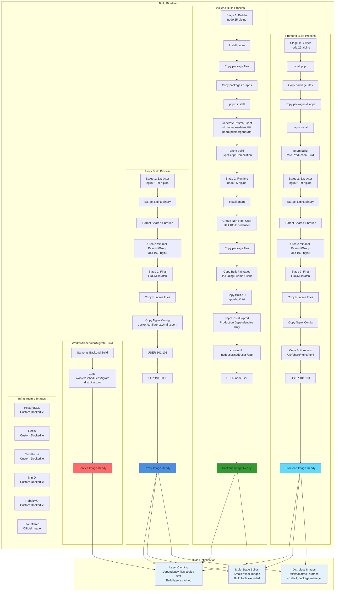

```mermaid
graph TB
    subgraph "Build Pipeline"
        direction TB

        subgraph "Frontend Build Process"
            F1[Stage 1: Builder<br/>node:25-alpine]
            F2[Install pnpm]
            F3[Copy package files]
            F4[Copy packages & apps]
            F5[pnpm install]
            F6[pnpm build<br/>Vite Production Build]
            F7[Stage 2: Extractor<br/>nginx:1.29-alpine]
            F8[Extract Nginx Binary]
            F9[Extract Shared Libraries]
            F10[Create Minimal Passwd/Group<br/>UID 101: nginx]
            F11[Stage 3: Final<br/>FROM scratch]
            F12[Copy Runtime Files]
            F13[Copy Nginx Config]
            F14[Copy Built Assets<br/>/usr/share/nginx/html]
            F15[USER 101:101]
            F16[Frontend Image Ready]

            F1 --> F2 --> F3 --> F4 --> F5 --> F6
            F6 --> F7 --> F8 --> F9 --> F10
            F10 --> F11 --> F12 --> F13 --> F14 --> F15 --> F16
        end

        subgraph "Backend Build Process"
            B1[Stage 1: Builder<br/>node:25-alpine]
            B2[Install pnpm]
            B3[Copy package files]
            B4[Copy packages & apps]
            B5[pnpm install]
            B6[Generate Prisma Client<br/>cd packages/datas && pnpm prisma:generate]
            B7[pnpm build<br/>TypeScript Compilation]
            B8[Stage 2: Runtime<br/>node:25-alpine]
            B9[Install pnpm]
            B10[Create Non-Root User<br/>UID 1001: nodeuser]
            B11[Copy package files]
            B12[Copy Built Packages<br/>Including Prisma Client]
            B13[Copy Built API<br/>apps/api/dist]
            B14[pnpm install --prod<br/>Production Dependencies Only]
            B15[chown -R nodeuser:nodeuser /app]
            B16[USER nodeuser]
            B17[Backend Image Ready]

            B1 --> B2 --> B3 --> B4 --> B5 --> B6 --> B7
            B7 --> B8 --> B9 --> B10 --> B11 --> B12 --> B13 --> B14 --> B15 --> B16 --> B17
        end

        subgraph "Proxy Build Process"
            P1[Stage 1: Extractor<br/>nginx:1.29-alpine]
            P2[Extract Nginx Binary]
            P3[Extract Shared Libraries]
            P4[Create Minimal Passwd/Group<br/>UID 101: nginx]
            P5[Stage 2: Final<br/>FROM scratch]
            P6[Copy Runtime Files]
            P7[Copy Nginx Config<br/>docker/config/proxy/nginx.conf]
            P8[USER 101:101]
            P9[EXPOSE 8080]
            P10[Proxy Image Ready]

            P1 --> P2 --> P3 --> P4 --> P5 --> P6 --> P7 --> P8 --> P9 --> P10
        end

        subgraph "Worker/Scheduler/Migrate Build"
            W1[Same as Backend Build]
            W2[Copy Worker/Scheduler/Migrate<br/>dist directory]
            W3[Service Image Ready]

            W1 --> W2 --> W3
        end

        subgraph "Infrastructure Images"
            I1[PostgreSQL<br/>Custom Dockerfile]
            I2[Redis<br/>Custom Dockerfile]
            I3[ClickHouse<br/>Custom Dockerfile]
            I4[MinIO<br/>Custom Dockerfile]
            I5[RabbitMQ<br/>Custom Dockerfile]
            I6[Cloudflared<br/>Official Image]
        end
    end

    subgraph "Build Optimization"
        direction LR
        LayerCache["Layer Caching<br/>Dependency files copied first<br/>Build layers cached"]
        MultiStage["Multi-Stage Builds<br/>Smaller final images<br/>Build tools excluded"]
        Distroless["Distroless Images<br/>Minimal attack surface<br/>No shell, package manager"]
    end

    F16 --> LayerCache
    B17 --> LayerCache
    P10 --> LayerCache
    W3 --> LayerCache

    F16 --> MultiStage
    B17 --> MultiStage
    P10 --> MultiStage

    F16 --> Distroless
    P10 --> Distroless

    style F16 fill:#61dafb
    style B17 fill:#339933
    style P10 fill:#4a90e2
    style W3 fill:#ff6b6b
    style LayerCache fill:#e3f2fd
    style MultiStage fill:#e3f2fd
    style Distroless fill:#e3f2fd
```
