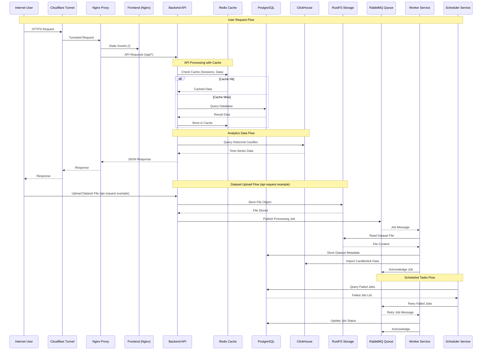

```mermaid
sequenceDiagram
    participant User as Internet User
    participant CF as Cloudflare Tunnel
    participant Proxy as Nginx Proxy
    participant Frontend as Frontend (Nginx)
    participant API as Backend API
    participant Redis as Redis Cache
    participant Postgres as PostgreSQL
    participant ClickHouse as ClickHouse
    participant RustFS as RustFS Storage
    participant RabbitMQ as RabbitMQ Queue
    participant Worker as Worker Service
    participant Scheduler as Scheduler Service

    Note over User,Scheduler: User Request Flow
    User->>CF: HTTPS Request
    CF->>Proxy: Tunneled Request
    Proxy->>Frontend: Static Assets (/)
    Proxy->>API: API Requests (/api/*)

    Note over API,Redis: API Processing with Cache
    API->>Redis: Check Cache (Sessions, Data)
    alt Cache Hit
        Redis-->>API: Cached Data
    else Cache Miss
        API->>Postgres: Query Database
        Postgres-->>API: Result Data
        API->>Redis: Store in Cache
    end

    Note over API,ClickHouse: Analytics Data Flow
    API->>ClickHouse: Query Historical Candles
    ClickHouse-->>API: Time-Series Data
    API-->>Proxy: JSON Response
    Proxy-->>CF: Response
    CF-->>User: Response

    Note over API,RustFS: Dataset Upload Flow (api request example)
    User->>API: Upload Dataset File (api request example)
    API->>RustFS: Store File Object
    RustFS-->>API: File Stored
    API->>RabbitMQ: Publish Processing Job
    RabbitMQ-->>Worker: Job Message
    Worker->>RustFS: Read Dataset File
    RustFS-->>Worker: File Content
    Worker->>Postgres: Store Dataset Metadata
    Worker->>ClickHouse: Import Candlestick Data
    Worker->>RabbitMQ: Acknowledge Job

    Note over Scheduler,RabbitMQ: Scheduled Tasks Flow
    Scheduler->>Postgres: Query Failed Jobs
    Postgres-->>Scheduler: Failed Job List
    Scheduler->>RabbitMQ: Retry Failed Jobs
    RabbitMQ-->>Worker: Retry Job Message
    Worker->>Postgres: Update Job Status
    Worker->>RabbitMQ: Acknowledge
```
