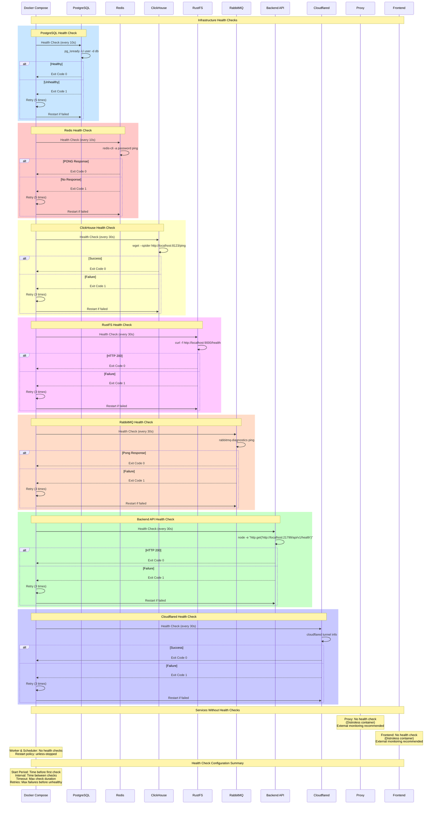

```mermaid
sequenceDiagram
    participant Docker as Docker Compose
    participant Postgres as PostgreSQL
    participant Redis as Redis
    participant ClickHouse as ClickHouse
    participant RustFS as RustFS
    participant RabbitMQ as RabbitMQ
    participant Backend as Backend API
    participant Cloudflared as Cloudflared
    participant Proxy as Proxy
    participant Frontend as Frontend

    Note over Docker,Frontend: Infrastructure Health Checks

    rect rgb(200, 230, 255)
        Note over Docker,Postgres: PostgreSQL Health Check
        Docker->>Postgres: Health Check (every 10s)
        Postgres->>Postgres: pg_isready -U user -d db
        alt Healthy
            Postgres-->>Docker: Exit Code 0
        else Unhealthy
            Postgres-->>Docker: Exit Code 1
            Docker->>Docker: Retry (5 times)
            Docker->>Postgres: Restart if failed
        end
    end

    rect rgb(255, 200, 200)
        Note over Docker,Redis: Redis Health Check
        Docker->>Redis: Health Check (every 10s)
        Redis->>Redis: redis-cli -a password ping
        alt PONG Response
            Redis-->>Docker: Exit Code 0
        else No Response
            Redis-->>Docker: Exit Code 1
            Docker->>Docker: Retry (5 times)
            Docker->>Redis: Restart if failed
        end
    end

    rect rgb(255, 255, 200)
        Note over Docker,ClickHouse: ClickHouse Health Check
        Docker->>ClickHouse: Health Check (every 30s)
        ClickHouse->>ClickHouse: wget --spider http://localhost:8123/ping
        alt Success
            ClickHouse-->>Docker: Exit Code 0
        else Failure
            ClickHouse-->>Docker: Exit Code 1
            Docker->>Docker: Retry (3 times)
            Docker->>ClickHouse: Restart if failed
        end
    end

    rect rgb(255, 200, 255)
        Note over Docker,RustFS: RustFS Health Check
        Docker->>RustFS: Health Check (every 30s)
        RustFS->>RustFS: curl -f http://localhost:9000/health
        alt HTTP 200
            RustFS-->>Docker: Exit Code 0
        else Failure
            RustFS-->>Docker: Exit Code 1
            Docker->>Docker: Retry (3 times)
            Docker->>RustFS: Restart if failed
        end
    end

    rect rgb(255, 220, 200)
        Note over Docker,RabbitMQ: RabbitMQ Health Check
        Docker->>RabbitMQ: Health Check (every 30s)
        RabbitMQ->>RabbitMQ: rabbitmq-diagnostics ping
        alt Pong Response
            RabbitMQ-->>Docker: Exit Code 0
        else Failure
            RabbitMQ-->>Docker: Exit Code 1
            Docker->>Docker: Retry (3 times)
            Docker->>RabbitMQ: Restart if failed
        end
    end

    rect rgb(200, 255, 200)
        Note over Docker,Backend: Backend API Health Check
        Docker->>Backend: Health Check (every 30s)
        Backend->>Backend: node -e "http.get('http://localhost:21799/api/v1/health')"
        alt HTTP 200
            Backend-->>Docker: Exit Code 0
        else Failure
            Backend-->>Docker: Exit Code 1
            Docker->>Docker: Retry (3 times)
            Docker->>Backend: Restart if failed
        end
    end

    rect rgb(200, 200, 255)
        Note over Docker,Cloudflared: Cloudflared Health Check
        Docker->>Cloudflared: Health Check (every 30s)
        Cloudflared->>Cloudflared: cloudflared tunnel info
        alt Success
            Cloudflared-->>Docker: Exit Code 0
        else Failure
            Cloudflared-->>Docker: Exit Code 1
            Docker->>Docker: Retry (3 times)
            Docker->>Cloudflared: Restart if failed
        end
    end

    Note over Docker,Frontend: Services Without Health Checks
    Note over Proxy: Proxy: No health check<br/>(Distroless container)<br/>External monitoring recommended
    Note over Frontend: Frontend: No health check<br/>(Distroless container)<br/>External monitoring recommended
    Note over Docker: Worker & Scheduler: No health checks<br/>Restart policy: unless-stopped

    Note over Docker,Frontend: Health Check Configuration Summary
    Note over Docker: Start Period: Time before first check<br/>Interval: Time between checks<br/>Timeout: Max check duration<br/>Retries: Max failures before unhealthy
```
