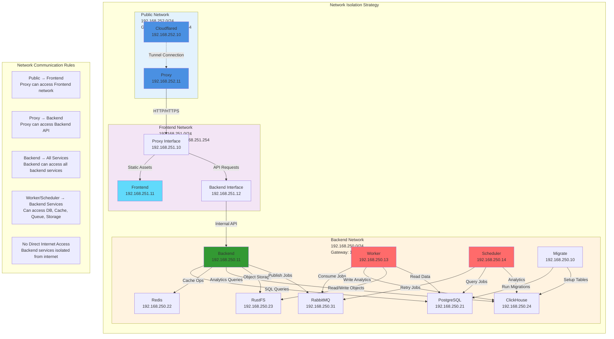

```mermaid
graph TB
    subgraph "Network Isolation Strategy"
        direction TB

        subgraph PublicNet["Public Network<br/>192.168.252.0/24<br/>Gateway: 192.168.252.254"]
            Cloudflared[Cloudflared<br/>192.168.252.10]
            Proxy[Proxy<br/>192.168.252.11]
        end

        subgraph FrontendNet["Frontend Network<br/>192.168.251.0/24<br/>Gateway: 192.168.251.254"]
            Frontend[Frontend<br/>192.168.251.11]
            ProxyFrontend[Proxy Interface<br/>192.168.251.10]
            BackendFrontend[Backend Interface<br/>192.168.251.12]
        end

        subgraph BackendNet["Backend Network<br/>192.168.250.0/24<br/>Gateway: 192.168.250.254"]
            Backend[Backend<br/>192.168.250.11]
            Worker[Worker<br/>192.168.250.13]
            Scheduler[Scheduler<br/>192.168.250.14]
            Migrate[Migrate<br/>192.168.250.10]
            Postgres[PostgreSQL<br/>192.168.250.21]
            Redis[Redis<br/>192.168.250.22]
            ClickHouse[ClickHouse<br/>192.168.250.24]
            RustFS[RustFS<br/>192.168.250.23]
            RabbitMQ[RabbitMQ<br/>192.168.250.31]
        end
    end

    subgraph "Network Communication Rules"
        direction LR
        Rule1["Public → Frontend<br/>Proxy can access Frontend network"]
        Rule2["Proxy → Backend<br/>Proxy can access Backend API"]
        Rule3["Backend → All Services<br/>Backend can access all backend services"]
        Rule4["Worker/Scheduler → Backend Services<br/>Can access DB, Cache, Queue, Storage"]
        Rule5["No Direct Internet Access<br/>Backend services isolated from internet"]
    end

    Cloudflared -.->|"Tunnel Connection"| Proxy
    Proxy -->|"HTTP/HTTPS"| ProxyFrontend
    ProxyFrontend -->|"Static Assets"| Frontend
    ProxyFrontend -->|"API Requests"| BackendFrontend
    BackendFrontend -->|"Internal API"| Backend

    Backend -->|"SQL Queries"| Postgres
    Backend -->|"Cache Ops"| Redis
    Backend -->|"Analytics Queries"| ClickHouse
    Backend -->|"Object Storage"| RustFS
    Backend -->|"Publish Jobs"| RabbitMQ

    Worker -->|"Consume Jobs"| RabbitMQ
    Worker -->|"Write Analytics"| ClickHouse
    Worker -->|"Read/Write Objects"| RustFS
    Worker -->|"Read Data"| Postgres

    Scheduler -->|"Retry Jobs"| RabbitMQ
    Scheduler -->|"Query Jobs"| Postgres
    Scheduler -->|"Analytics"| ClickHouse

    Migrate -->|"Run Migrations"| Postgres
    Migrate -->|"Setup Tables"| ClickHouse

    style PublicNet fill:#e3f2fd
    style FrontendNet fill:#f3e5f5
    style BackendNet fill:#fff3e0
    style Cloudflared fill:#4a90e2
    style Proxy fill:#4a90e2
    style Frontend fill:#61dafb
    style Backend fill:#339933
    style Worker fill:#ff6b6b
    style Scheduler fill:#ff6b6b
```
