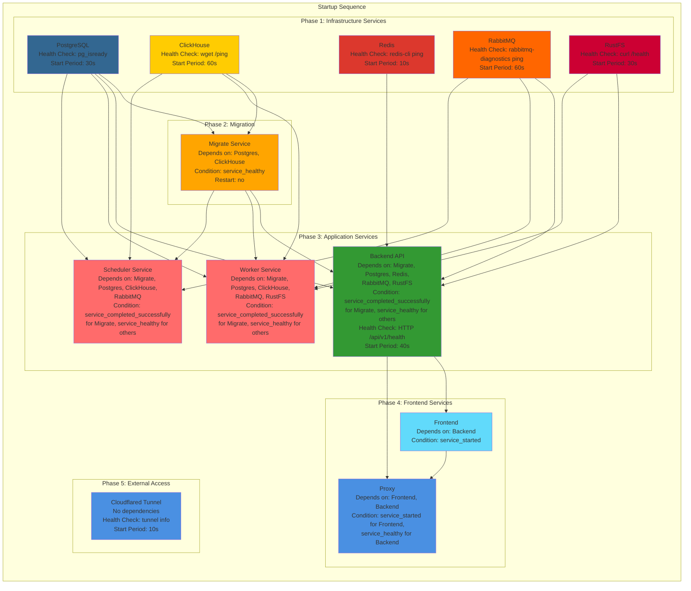

```mermaid
graph TB
    subgraph "Startup Sequence"
        direction TB

        subgraph "Phase 1: Infrastructure Services"
            Postgres[PostgreSQL<br/>Health Check: pg_isready<br/>Start Period: 30s]
            Redis[Redis<br/>Health Check: redis-cli ping<br/>Start Period: 10s]
            ClickHouse[ClickHouse<br/>Health Check: wget /ping<br/>Start Period: 60s]
            RustFS[RustFS<br/>Health Check: curl /health<br/>Start Period: 30s]
            RabbitMQ[RabbitMQ<br/>Health Check: rabbitmq-diagnostics ping<br/>Start Period: 60s]
        end

        subgraph "Phase 2: Migration"
            Migrate[Migrate Service<br/>Depends on: Postgres, ClickHouse<br/>Condition: service_healthy<br/>Restart: no]
        end

        subgraph "Phase 3: Application Services"
            Backend[Backend API<br/>Depends on: Migrate, Postgres, Redis,<br/>RabbitMQ, RustFS<br/>Condition: service_completed_successfully<br/>for Migrate, service_healthy for others<br/>Health Check: HTTP /api/v1/health<br/>Start Period: 40s]

            Worker[Worker Service<br/>Depends on: Migrate, Postgres, ClickHouse,<br/>RabbitMQ, RustFS<br/>Condition: service_completed_successfully<br/>for Migrate, service_healthy for others]

            Scheduler[Scheduler Service<br/>Depends on: Migrate, Postgres, ClickHouse,<br/>RabbitMQ<br/>Condition: service_completed_successfully<br/>for Migrate, service_healthy for others]
        end

        subgraph "Phase 4: Frontend Services"
            Frontend[Frontend<br/>Depends on: Backend<br/>Condition: service_started]
            Proxy[Proxy<br/>Depends on: Frontend, Backend<br/>Condition: service_started for Frontend,<br/>service_healthy for Backend]
        end

        subgraph "Phase 5: External Access"
            Cloudflared[Cloudflared Tunnel<br/>No dependencies<br/>Health Check: tunnel info<br/>Start Period: 10s]
        end
    end

    Postgres --> Migrate
    ClickHouse --> Migrate

    Migrate --> Backend
    Postgres --> Backend
    Redis --> Backend
    RabbitMQ --> Backend
    RustFS --> Backend

    Migrate --> Worker
    Postgres --> Worker
    ClickHouse --> Worker
    RabbitMQ --> Worker
    RustFS --> Worker

    Migrate --> Scheduler
    Postgres --> Scheduler
    ClickHouse --> Scheduler
    RabbitMQ --> Scheduler

    Backend --> Frontend
    Frontend --> Proxy
    Backend --> Proxy

    style Postgres fill:#336791
    style Redis fill:#dc382d
    style ClickHouse fill:#ffcc02
    style RustFS fill:#c03
    style RabbitMQ fill:#ff6600
    style Migrate fill:#ffa500
    style Backend fill:#339933
    style Worker fill:#ff6b6b
    style Scheduler fill:#ff6b6b
    style Frontend fill:#61dafb
    style Proxy fill:#4a90e2
    style Cloudflared fill:#4a90e2
```
