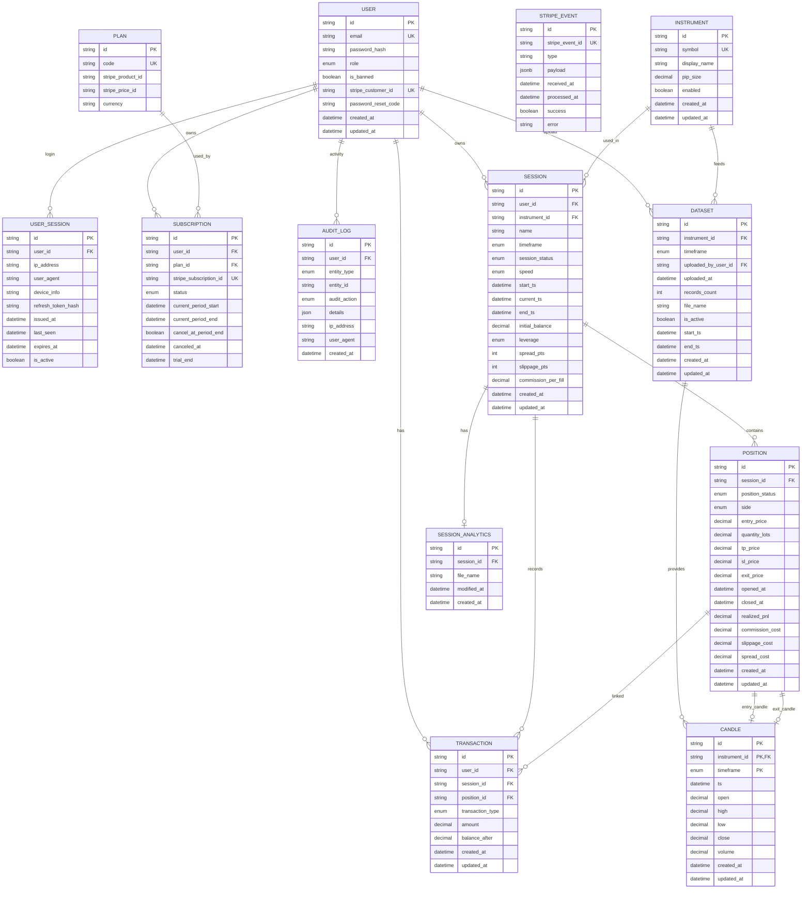

```mermaid


erDiagram
    %% =========================
    %% ENUMS (defined in code)
    %% =========================
    %% role: ANONYMOUS | ADMIN
    %% session_status: RUNNING | PAUSED | ARCHIVED
    %% position_status: OPEN | CLOSED | LIQUIDATED
    %% timeframe: M1 | M5 | M10 | M15 | M30 | H1 | H2 | H4 | D1 | W1
    %% side: BUY | SELL
    %% speed: 0.5x | 1x | 2x | 3x | 5x | 10x | 15x
    %% leverage: 1x | 50x | 100x | 200x | 500x | 1000x
    %% transaction_type: DEPOSIT | WITHDRAWAL | COMMISSION | PNL | SLIPPAGE | SPREAD | ADJUSTMENT
    %% entity_type: USER | SESSION | TRANSACTION | SUBSCRIPTION | POSITION
    %% audit_action: CREATE | UPDATE | DELETE | LOGIN | LOGOUT | PASSWORD_CHANGE | ROLE_CHANGE | BAN | UNBAN

    USER {
      string id PK
      string email UK
      string password_hash
      enum role
      boolean is_banned
      string stripe_customer_id UK
      string password_reset_code
      datetime created_at
      datetime updated_at
    }

    USER_SESSION {
      string id PK
      string user_id FK
      string ip_address
      string user_agent
      string device_info
      string refresh_token_hash
      datetime issued_at
      datetime last_seen
      datetime expires_at
      boolean is_active
    }

    PLAN {
      string id PK
      string code UK
      string stripe_product_id
      string stripe_price_id
      string currency
    }

    SUBSCRIPTION {
      string id PK
      string user_id FK
      string plan_id FK
      string stripe_subscription_id UK
      enum status
      datetime current_period_start
      datetime current_period_end
      boolean cancel_at_period_end
      datetime canceled_at
      datetime trial_end
    }

    STRIPE_EVENT {
      string id PK
      string stripe_event_id UK
      string type
      jsonb payload
      datetime received_at
      datetime processed_at
      boolean success
      string error
    }

    AUDIT_LOG {
      string id PK
      string user_id FK
      enum entity_type
      string entity_id
      enum audit_action
      json details
      string ip_address
      string user_agent
      datetime created_at
    }

    INSTRUMENT {
      string id PK
      string symbol UK
      string display_name
      decimal pip_size
      boolean enabled
      datetime created_at
      datetime updated_at
    }

    DATASET {
      string id PK
      string instrument_id FK
      enum timeframe
      string uploaded_by_user_id FK
      datetime uploaded_at
      int records_count
      string file_name
      boolean is_active
      datetime start_ts
      datetime end_ts
      datetime created_at
      datetime updated_at
    }

    CANDLE {
      string id PK
      string instrument_id PK, FK
      enum timeframe PK
      datetime ts
      decimal open
      decimal high
      decimal low
      decimal close
      decimal volume
      datetime created_at
      datetime updated_at
    }

    SESSION {
      string id PK
      string user_id FK
      string instrument_id FK
      string name
      enum timeframe
      enum session_status
      enum speed
      datetime start_ts
      datetime current_ts
      datetime end_ts
      decimal initial_balance
      enum leverage
      int spread_pts
      int slippage_pts
      decimal commission_per_fill
      datetime created_at
      datetime updated_at
    }

    POSITION {
      string id PK
      string session_id FK
      enum position_status
      enum side
      decimal entry_price
      decimal quantity_lots
      decimal tp_price
      decimal sl_price
      decimal exit_price
      datetime opened_at
      datetime closed_at
      decimal realized_pnl
      decimal commission_cost
      decimal slippage_cost
      decimal spread_cost
      datetime created_at
      datetime updated_at
    }

    TRANSACTION {
      string id PK
      string user_id FK
      string session_id FK
      string position_id FK
      enum transaction_type
      decimal amount
      decimal balance_after
      datetime created_at
      datetime updated_at
    }

    SESSION_ANALYTICS {
      string id PK
      string session_id FK
      string file_name
      datetime modified_at
      datetime created_at
    }


    USER ||--o{ SESSION : "owns"
    USER ||--o{ SUBSCRIPTION : "owns"
    PLAN ||--o{ SUBSCRIPTION : "used_by"
    USER ||--o{ DATASET : "upload"
    INSTRUMENT ||--o{ DATASET : "feeds"
    INSTRUMENT ||--o{ SESSION : "used_in"
    SESSION ||--o{ POSITION : "contains"
    DATASET ||--o{ CANDLE : "provides"
    USER ||--o{ TRANSACTION : "has"
    SESSION ||--o{ TRANSACTION : "records"
    POSITION ||--o{ TRANSACTION : "linked"
    USER ||--o{ USER_SESSION : "login"
    POSITION ||--o| CANDLE : "entry_candle"
    POSITION ||--o| CANDLE : "exit_candle"
    USER ||--o{ AUDIT_LOG : "activity"
    SESSION ||--o| SESSION_ANALYTICS : "has"

```
