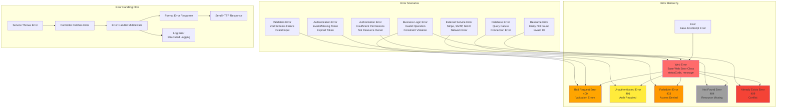

```mermaid
graph TB
    subgraph "Error Hierarchy"
        Error[Error<br/>Base JavaScript Error]
        WebError[Web Error<br/>Base Web Error Class<br/>statusCode, message]

        BadRequestError[Bad Request Error<br/>400<br/>Validation Errors]
        UnauthenticatedError[Unauthenticated Error<br/>401<br/>Auth Required]
        ForbiddenError[Forbidden Error<br/>403<br/>Access Denied]
        NotFoundError[Not Found Error<br/>404<br/>Resource Missing]
        AlreadyExistsError[Already Exists Error<br/>409<br/>Conflict]
    end

    subgraph "Error Scenarios"
        ValidationError[Validation Error<br/>Zod Schema Failure<br/>Invalid Input]
        AuthError[Authentication Error<br/>Invalid/Missing Token<br/>Expired Token]
        AuthzError[Authorization Error<br/>Insufficient Permissions<br/>Not Resource Owner]
        ResourceError[Resource Error<br/>Entity Not Found<br/>Invalid ID]
        BusinessError[Business Logic Error<br/>Invalid Operation<br/>Constraint Violation]
        DatabaseError[Database Error<br/>Query Failure<br/>Connection Error]
        ExternalError[External Service Error<br/>Stripe, SMTP, MinIO<br/>Network Error]
    end

    subgraph "Error Handling Flow"
        ThrowError[Service Throws Error]
        CatchError[Controller Catches Error]
        ErrorHandler[Error Handler Middleware]
        FormatError[Format Error Response]
        LogError[Log Error<br/>Structured Logging]
        SendResponse[Send HTTP Response]
    end

    Error --> WebError
    WebError --> BadRequestError
    WebError --> UnauthenticatedError
    WebError --> ForbiddenError
    WebError --> NotFoundError
    WebError --> AlreadyExistsError

    ValidationError --> BadRequestError
    AuthError --> UnauthenticatedError
    AuthzError --> ForbiddenError
    ResourceError --> NotFoundError
    BusinessError --> BadRequestError
    BusinessError --> AlreadyExistsError
    DatabaseError --> WebError
    ExternalError --> WebError

    ThrowError --> CatchError
    CatchError --> ErrorHandler
    ErrorHandler --> FormatError
    ErrorHandler --> LogError
    FormatError --> SendResponse

    style WebError fill:#ff6b6b
    style BadRequestError fill:#ffa500
    style UnauthenticatedError fill:#ffeb3b
    style ForbiddenError fill:#ff9800
    style NotFoundError fill:#9e9e9e
    style AlreadyExistsError fill:#f44336
```
