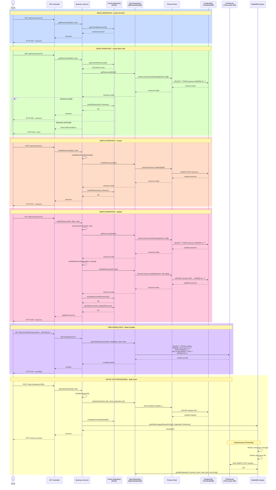

    rect rgb(200, 255, 255)
    note over Client,PostgreSQL: DELETE OPERATION
    Client->>Controller: DELETE /api/v1/resource/:id
    Controller->>Service: deleteResource(id, user)
    Service->>Service: ensureUserAccess(id, user)
    Service->>DataRepo: deleteResource(id)
    DataRepo->>Prisma: prisma.resource.delete({where: {id}})
    Prisma->>PostgreSQL: DELETE FROM resource WHERE id = ?
    PostgreSQL-->>Prisma: deleted resource
    Prisma-->>DataRepo: resource entity
    DataRepo-->>Service: resource entity
    Service->>CacheRepo: invalidateCachedResource(id)
    CacheRepo-->>Service: OK
    Service-->>Controller: deleted resource
    Controller-->>Client: HTTP 200 + resource
    end
