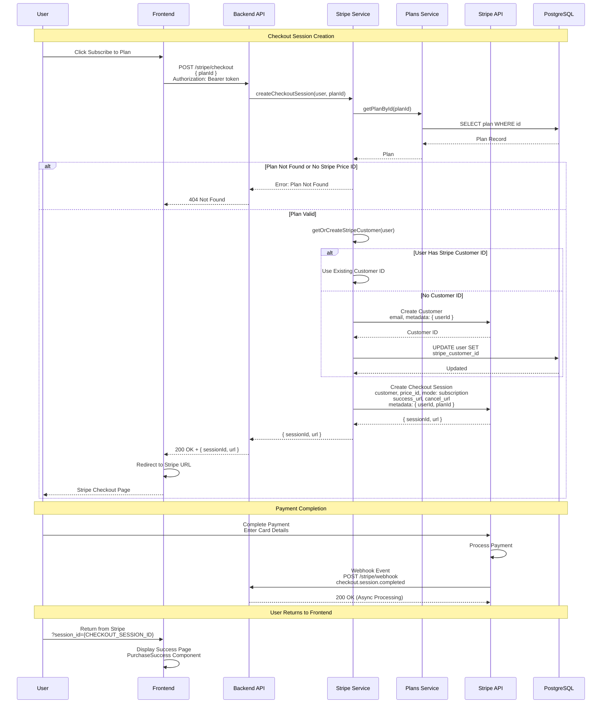

```mermaid
sequenceDiagram
    participant User
    participant Frontend
    participant API as Backend API
    participant StripeService as Stripe Service
    participant PlansService as Plans Service
    participant Stripe as Stripe API
    participant DB as PostgreSQL

    Note over User,DB: Checkout Session Creation

    User->>Frontend: Click Subscribe to Plan
    Frontend->>API: POST /stripe/checkout<br/>{ planId }<br/>Authorization: Bearer token

    API->>StripeService: createCheckoutSession(user, planId)
    StripeService->>PlansService: getPlanById(planId)
    PlansService->>DB: SELECT plan WHERE id
    DB-->>PlansService: Plan Record
    PlansService-->>StripeService: Plan

    alt Plan Not Found or No Stripe Price ID
        StripeService-->>API: Error: Plan Not Found
        API-->>Frontend: 404 Not Found
    else Plan Valid
        StripeService->>StripeService: getOrCreateStripeCustomer(user)

        alt User Has Stripe Customer ID
            StripeService->>StripeService: Use Existing Customer ID
        else No Customer ID
            StripeService->>Stripe: Create Customer<br/>email, metadata: { userId }
            Stripe-->>StripeService: Customer ID
            StripeService->>DB: UPDATE user SET<br/>stripe_customer_id
            DB-->>StripeService: Updated
        end

        StripeService->>Stripe: Create Checkout Session<br/>customer, price_id, mode: subscription<br/>success_url, cancel_url<br/>metadata: { userId, planId }
        Stripe-->>StripeService: { sessionId, url }

        StripeService-->>API: { sessionId, url }
        API-->>Frontend: 200 OK + { sessionId, url }
        Frontend->>Frontend: Redirect to Stripe URL
        Frontend-->>User: Stripe Checkout Page
    end

    Note over User,DB: Payment Completion

    User->>Stripe: Complete Payment<br/>Enter Card Details
    Stripe->>Stripe: Process Payment
    Stripe->>API: Webhook Event<br/>POST /stripe/webhook<br/>checkout.session.completed
    API-->>Stripe: 200 OK (Async Processing)

    Note over User,DB: User Returns to Frontend

    User->>Frontend: Return from Stripe<br/>?session_id={CHECKOUT_SESSION_ID}
    Frontend->>Frontend: Display Success Page<br/>PurchaseSuccess Component
```
