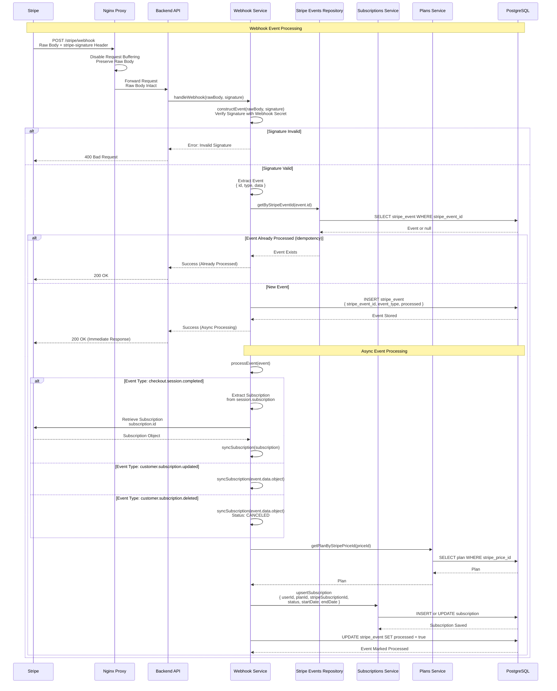

```mermaid
sequenceDiagram
    participant Stripe
    participant Proxy as Nginx Proxy
    participant API as Backend API
    participant WebhookService as Webhook Service
    participant StripeEventsRepo as Stripe Events Repository
    participant SubscriptionsService as Subscriptions Service
    participant PlansService as Plans Service
    participant DB as PostgreSQL

    Note over Stripe,DB: Webhook Event Processing

    Stripe->>Proxy: POST /stripe/webhook<br/>Raw Body + stripe-signature Header
    Proxy->>Proxy: Disable Request Buffering<br/>Preserve Raw Body
    Proxy->>API: Forward Request<br/>Raw Body Intact

    API->>WebhookService: handleWebhook(rawBody, signature)
    WebhookService->>WebhookService: constructEvent(rawBody, signature)<br/>Verify Signature with Webhook Secret

    alt Signature Invalid
        WebhookService-->>API: Error: Invalid Signature
        API-->>Stripe: 400 Bad Request
    else Signature Valid
        WebhookService->>WebhookService: Extract Event<br/>{ id, type, data }

        WebhookService->>StripeEventsRepo: getByStripeEventId(event.id)
        StripeEventsRepo->>DB: SELECT stripe_event WHERE stripe_event_id
        DB-->>StripeEventsRepo: Event or null

        alt Event Already Processed (Idempotency)
            StripeEventsRepo-->>WebhookService: Event Exists
            WebhookService-->>API: Success (Already Processed)
            API-->>Stripe: 200 OK
        else New Event
            WebhookService->>DB: INSERT stripe_event<br/>{ stripe_event_id, event_type, processed }
            DB-->>WebhookService: Event Stored

            WebhookService-->>API: Success (Async Processing)
            API-->>Stripe: 200 OK (Immediate Response)

            Note over WebhookService,DB: Async Event Processing

            WebhookService->>WebhookService: processEvent(event)

            alt Event Type: checkout.session.completed
                WebhookService->>WebhookService: Extract Subscription<br/>from session.subscription
                WebhookService->>Stripe: Retrieve Subscription<br/>subscription.id
                Stripe-->>WebhookService: Subscription Object
                WebhookService->>WebhookService: syncSubscription(subscription)
            else Event Type: customer.subscription.updated
                WebhookService->>WebhookService: syncSubscription(event.data.object)
            else Event Type: customer.subscription.deleted
                WebhookService->>WebhookService: syncSubscription(event.data.object)<br/>Status: CANCELED
            end

            WebhookService->>PlansService: getPlanByStripePriceId(priceId)
            PlansService->>DB: SELECT plan WHERE stripe_price_id
            DB-->>PlansService: Plan
            PlansService-->>WebhookService: Plan

            WebhookService->>SubscriptionsService: upsertSubscription<br/>{ userId, planId, stripeSubscriptionId,<br/>status, startDate, endDate }
            SubscriptionsService->>DB: INSERT or UPDATE subscription
            DB-->>SubscriptionsService: Subscription Saved

            WebhookService->>DB: UPDATE stripe_event SET processed = true
            DB-->>WebhookService: Event Marked Processed
        end
    end
```
