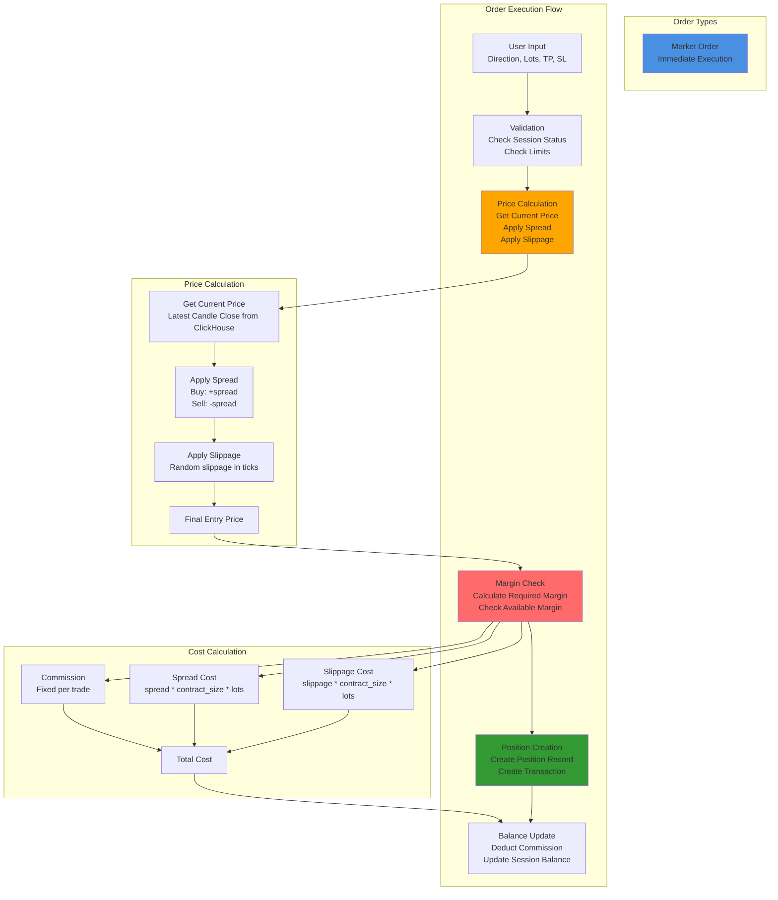

```mermaid
graph TB
    subgraph "Order Types"
        MarketOrder[Market Order<br/>Immediate Execution]
    end

    subgraph "Order Execution Flow"
        UserInput[User Input<br/>Direction, Lots, TP, SL]
        Validation[Validation<br/>Check Session Status<br/>Check Limits]
        PriceCalculation[Price Calculation<br/>Get Current Price<br/>Apply Spread<br/>Apply Slippage]
        MarginCheck[Margin Check<br/>Calculate Required Margin<br/>Check Available Margin]
        PositionCreation[Position Creation<br/>Create Position Record<br/>Create Transaction]
        BalanceUpdate[Balance Update<br/>Deduct Commission<br/>Update Session Balance]
    end

    subgraph "Price Calculation"
        CurrentPrice[Get Current Price<br/>Latest Candle Close from ClickHouse]
        SpreadApplication[Apply Spread<br/>Buy: +spread<br/>Sell: -spread]
        SlippageApplication[Apply Slippage<br/>Random slippage in ticks]
        FinalPrice[Final Entry Price]
    end

    subgraph "Cost Calculation"
        Commission[Commission<br/>Fixed per trade]
        SpreadCost[Spread Cost<br/>spread * contract_size * lots]
        SlippageCost[Slippage Cost<br/>slippage * contract_size * lots]
        TotalCost[Total Cost]
    end

    UserInput --> Validation
    Validation --> PriceCalculation
    PriceCalculation --> CurrentPrice
    CurrentPrice --> SpreadApplication
    SpreadApplication --> SlippageApplication
    SlippageApplication --> FinalPrice

    FinalPrice --> MarginCheck
    MarginCheck --> Commission
    MarginCheck --> SpreadCost
    MarginCheck --> SlippageCost

    Commission --> TotalCost
    SpreadCost --> TotalCost
    SlippageCost --> TotalCost

    TotalCost --> BalanceUpdate
    MarginCheck --> PositionCreation
    PositionCreation --> BalanceUpdate

    style MarketOrder fill:#4a90e2
    style PriceCalculation fill:#ffa500
    style MarginCheck fill:#ff6b6b
    style PositionCreation fill:#339933
```
