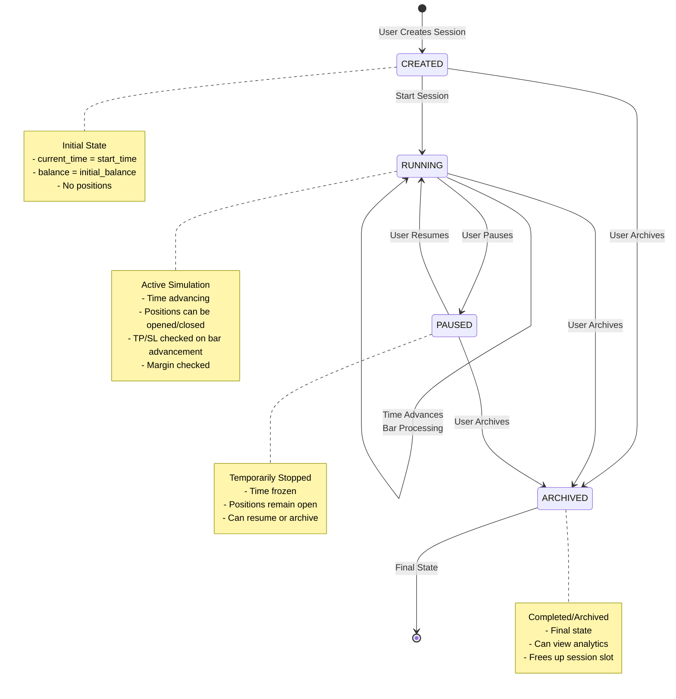

```mermaid
stateDiagram-v2
    [*] --> CREATED: User Creates Session

    CREATED --> RUNNING: Start Session
    CREATED --> ARCHIVED: User Archives

    RUNNING --> PAUSED: User Pauses
    RUNNING --> ARCHIVED: User Archives
    RUNNING --> RUNNING: Time Advances<br/>Bar Processing

    PAUSED --> RUNNING: User Resumes
    PAUSED --> ARCHIVED: User Archives

    ARCHIVED --> [*]: Final State

    note right of CREATED
        Initial State
        - current_time = start_time
        - balance = initial_balance
        - No positions
    end note

    note right of RUNNING
        Active Simulation
        - Time advancing
        - Positions can be opened/closed
        - TP/SL checked on bar advancement
        - Margin checked
    end note

    note right of PAUSED
        Temporarily Stopped
        - Time frozen
        - Positions remain open
        - Can resume or archive
    end note

    note right of ARCHIVED
        Completed/Archived
        - Final state
        - Can view analytics
        - Frees up session slot
    end note
```
